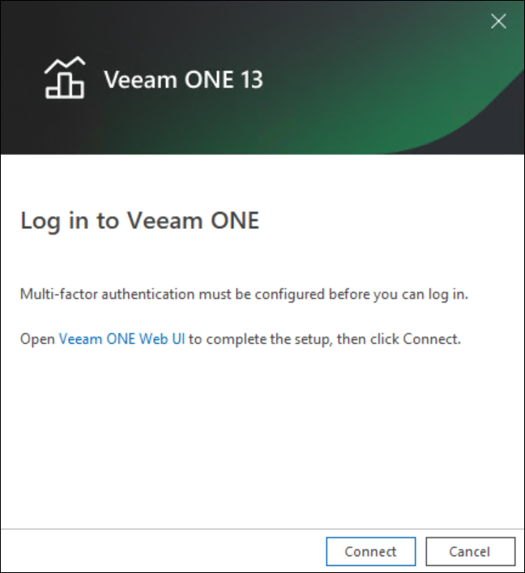
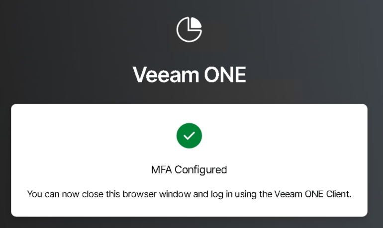
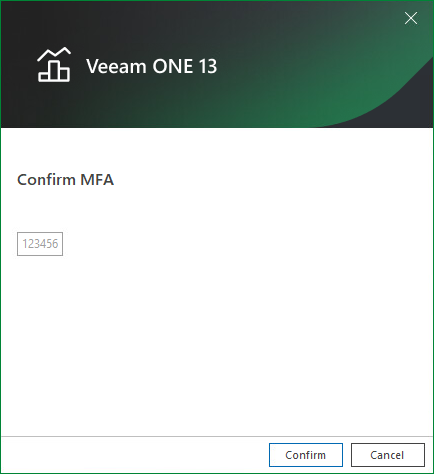
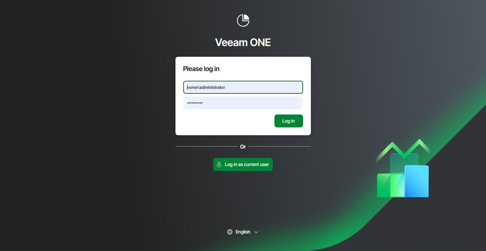
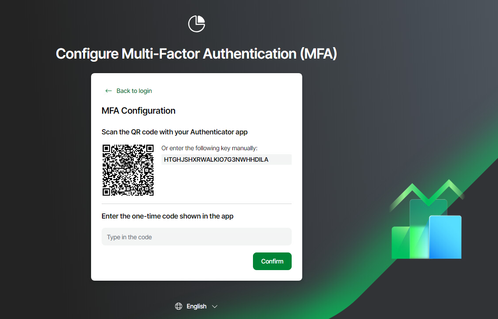

# Accessing Veeam ONE Components

You can interact with Veeam ONE using Veeam ONE Client, Veeam ONE Web Client and REST API:

Veeam ONE Client

To access Veeam ONE Client:

1. Log on to the machine where Veeam ONE Client is installed.
2. From the Microsoft Windows Start menu, choose Veeam ONE Client.
3. In the authentication window, specify the FQDN or IP address of a server where the Veeam ONE Server component runs and enter the credentials of the account used to connect to Veeam ONE Client. To connect using credentials of the account under which you are logged on to the machine, select the Log in as current user check box.

The user account must either:

* Be a member of the Veeam ONE Administrators or Veeam ONE Read-Only Users group. For details on user groups, see [Security Groups](security_groups.md).

Members of the Power User group can also access the Veeam ONE Client, but receive only the Read-Only role.

* Have permissions assigned to objects in the vCenter Server or VMware Cloud Director inventory hierarchy. For details on assigning permissions to objects, see [Multi-Tenant Monitoring and Reporting](multitenant.md).

This prerequisite applies to the VMware vSphere platform only.

1. Click Connect.

1. If Veeam ONE is configured to display a consent banner, read the banner content and click I Agree.

For details on configuring the consent banner, see [Banners](consent_banners.md).

1. If MFA is enabled for your Veeam ONE instance, but you have not conifigured it on the Log in to Veeam ONE screen:

1. Click the Veeam ONE Web Client link.

1. You are redirected to Veeam ONE Web Client and presented with the [Configure Multi-Factor Authentication](access.md#mfa-configure) screen. Scan the QR code with your preferred authenticator app and when instructed, close the browser window.

1. If multi-factor authentication (MFA) is enabled through Access Management, on the Multi-Factor Authentication (MFA) screen, enter the one-time code shown in your authenticator app and click Confirm.

For details on on configuring MFA, see [Configuring Multi-Factor Authentication](users_mfa.md).

To create a shortcut for the connection, click Save Shortcut. You can create one shortcut for every Veeam ONE server. The server name will be saved after the first successful login.

|  |
| --- |
| NOTE |
| If you want to save credentials for a connection in a shortcut, you must agree to save these credentials in the Windows Credentials Manager. |

Other Ways to Access Veeam ONE Client

To gain faster access to Veeam ONE Client, you can launch it without providing user credentials in the authentication window.

|  |
| --- |
| NOTE |
| When MFA is enabled, you cannot use these shortcuts to launch Veeam ONE Client unattended. Veeam ONE Client attempts to connect, but because MFA is required, the authentication window still opens — on the Multi-Factor Authentication (MFA) step, where you enter the one-time code and click Confirm. If you have not set up MFA yet, the authentication window opens on the step with the link to Veeam ONE Web Client. |

* To launch Veeam ONE Client under the account of a user that is currently logged to the machine, in the command shell call the Monitor.exe file that resides in the installation directory and pass the /currentuser parameter. For example:

"C:\Program Files\Veeam\Veeam ONE\Veeam ONE Monitor Client\Veeam.One.Client.exe" /currentuser

* To launch Veeam ONE Client with explicit user credentials, in the command shell call the Monitor.exe file that resides in the installation directory and pass the /username and /password parameters. For example:

"C:\Program Files\Veeam\Veeam ONE\Veeam ONE Monitor Client\Veeam.One.Client.exe" /username tech\john.smith /password PaSSw0rd

You can save this set of commands as a Windows shortcut and use it to quickly access Veeam ONE Client.

Veeam ONE Web Client

To access Veeam ONE Web Client:

1. Open the Veeam ONE Web Client website using one of the following options:

* Access Veeam ONE Web Client from the Veeam ONE Client. To do this, in the main menu, click Reports.
* Access Veeam ONE Web Client locally, on the machine where the Veeam ONE Web UI component is installed. To do this, choose Veeam ONE Web Client in the Microsoft Windows Programs menu.
* Access Veeam ONE Web Client remotely using your web browser. To do this, browse to the URL of the Veeam ONE Web Client website. This website runs on the machine where the Veeam ONE Web UI component is installed. The URL must look similar to the following one (assuming you use the default website port 1239):

https://webserver.domain.tld:1239

Note that Veeam ONE Web Client is available over HTTPS.

1. If Veeam ONE is configured to display a consent banner, read the banner content and click I Agree.
2. Enter credentials of a user account under which you want to connect to Veeam ONE Web Client.

The user account must either:

* Be a member of the Veeam ONE Administrators, Veeam ONE Power Users, Veeam ONE Backup Administrators or Veeam ONE Read-Only Users group. For details on user groups, see [Security Groups](security_groups.md).

* Have permissions assigned on objects in the vCenter Server or VMware Cloud Director inventory hierarchy. For details on, see [Multi-Tenant Monitoring and Reporting](multitenant.md).

This prerequisite applies to the VMware vSphere and VMware Cloud Director platforms.

1. Log in using one of the following methods:

* Click Log in — enter your login credential name and password.
* Click Log in as current user — log in using your stored credentials from a previous session using credentials under which you are logged onto the machine.
* Click  Log in with your certificate — log in using your stored credentials.
* Click Log in with SSO — log in using your preferred SSO provider.

1. If multi-factor authentication (MFA) is enabled through Access Management, on the Multi-Factor Authentication (MFA) screen, enter the one-time code shown in your authenticator app and click Log in. On the first login after MFA is enabled, you are prompted to set up MFA: scan the displayed QR code with your authenticator app or enter the secret key manually, then enter the generated code and click Confirm.

1. In the displayed Welcome pop-up window, click Start to view all updates.

If you do not want to view updates, click Skip.

If you do not want Veeam ONE Web Client to display the Welcome window, select the Don't show again check box.

|  |
| --- |
| Note: |
| If you log in for the first time, make sure that pop-up windows are allowed for the Veeam ONE Web Client website. |

If you used a self-signed certificate and try to access Veeam ONE Web Client from a remote machine, the browser will display a warning notifying that the connection is untrusted (although it is secured with TLS).

Veeam ONE REST API

For details on accessing Veeam ONE REST API Swagger UI, see section [Evaluation with Swagger UI](https://helpcenter.veeam.com/references/one/13/rest/tag/SectionOverview#section/Evaluation-with-Swagger-UI) of the REST API Reference guide.

|  |
| --- |
| NOTE |
| When MFA is enabled, it also applies to the Veeam ONE REST API. A POST request to the /token endpoint returns HTTP status code 428 when an MFA code or MFA setup is required. Pass the MFA code in the Veeam-Mfa-Code header. The restricted token returned in the 428 response grants access to the /mfa/\* endpoints only. |

Page updated 2026-08-07

