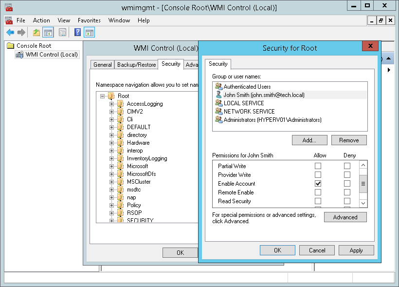
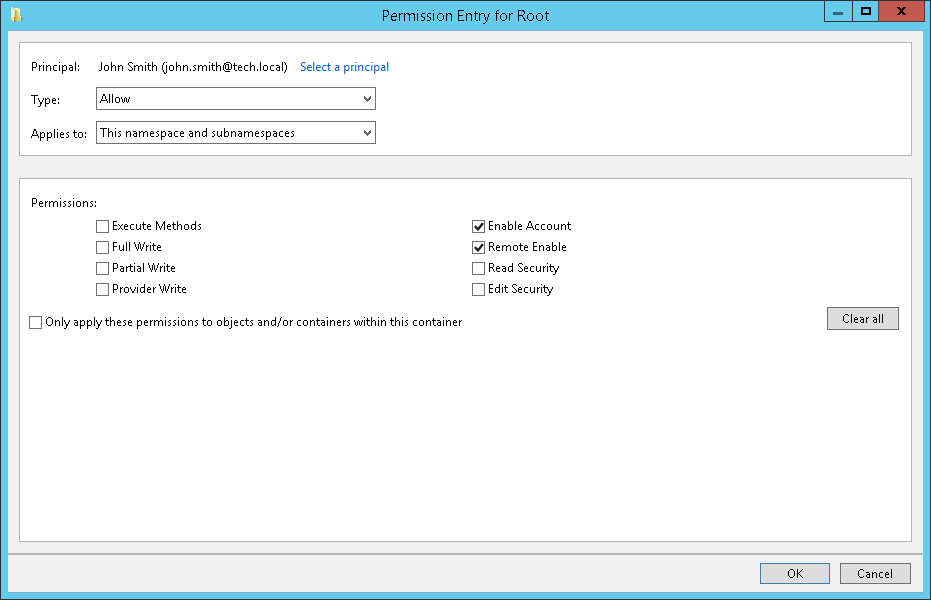
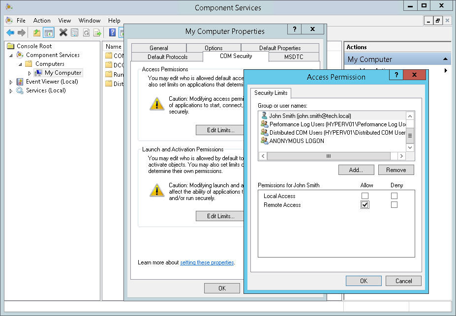
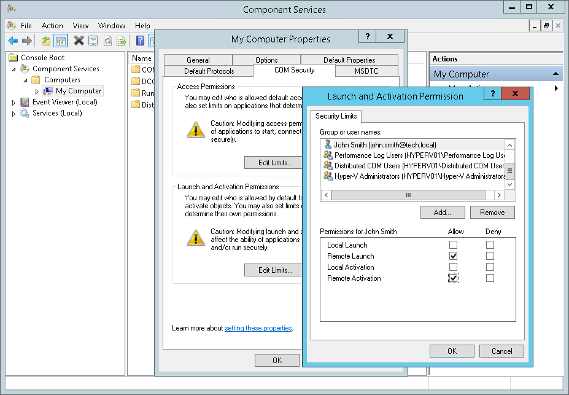
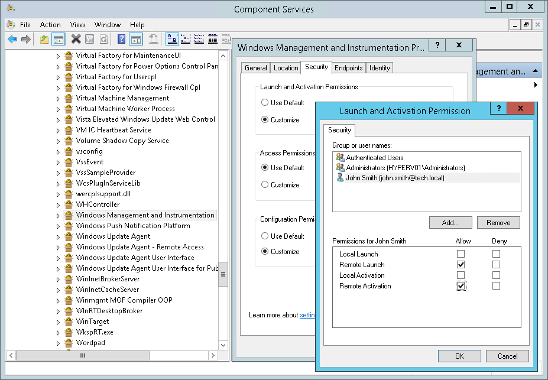

# Configuring Permissions to Remotely Access WMI

Veeam ONE collects data from Microsoft Windows machines using WMI. To make sure that Veeam ONE can collect data using WMI, the account under which you connect Microsoft Windows machines must have permissions to remotely access WMI.

For details on administrator permissions for connecting Veeam Backup & Replication and Veeam Backup Enterprise Manager see [Connection to Veeam Backup & Replication Servers](connection_to_backup_servers.md).

Permissions to access WMI remotely must be granted on:

* Microsoft Hyper-V hosts and clusters
* Veeam Backup & Replication servers

To configure permissions for remote access to WMI:

1. [Grant permissions to remotely access root WMI namespace and sub-namespaces](access_wmi_remotely.md#one).
2. [Grant remote access, launch and activation permissions for DCOM application](access_wmi_remotely.md#two).
3. [Grant remote launch and activation permissions for WMI](access_wmi_remotely.md#three).

|  |
| --- |
| Tip: |
| Instead of performing steps 2 and 3, you can add the user account to the Distributed COM Users group on target machines. |

Step 1. Grant Permissions to Remotely Access Root WMI Namespace and Sub-Namespaces

To grant to an account permissions for remote access to WMI:

1. Log on to a target Microsoft Windows machine as an Administrator.
2. Open the WMI Control Console.

To do so, choose Start > Run, type wmimgmt.msc and click OK.

1. Right-click WMI Control and select Properties.
2. In the WMI Control Properties window, open the Security tab.
3. On the Security tab, select the Root namespace.
4. Click Security.
5. In the Security for Root window, add the necessary user account.

1. Click Advanced.
2. In the Advanced Security Settings for Root window, select the user account and click Edit.
3. In the Permission Entry for Root window, do the following:

1. In the Applies to list, select This namespace and subnamespaces.
2. In the Permissions section, select Enable Account and Remote Enable.
3. Click OK.

1. In the Advanced Security Settings for Root window, click OK.
2. In the Security for Root window, click OK.
3. In the WMI Control Properties window, click OK.
4. Close the WMI Control Console.

Step 2. Grant Remote Access, Launch and Activation Permissions for DCOM Application

To grant to an account remote access, launch and activation permissions:

1. Open the Component Services Console.

To do so, choose Start > Run, type dcomcnfg and click OK.

1. In the navigation tree, go to Component Services > Computers > My Computer.
2. Right-click My Computer and select Properties.
3. In the My Computer Properties window, open the COM Security tab.
4. In the Access Permissions section, click Edit Limits.
5. In the Access Permission window, add the necessary user account.
6. Select the Remote Access permissions.
7. Click OK.

1. In the Launch and Activation Permissions section, click Edit Limits.
2. In the Launch and Activation Permission window, add the necessary user account.
3. Select the Remote Launch and Remote Activation permissions.
4. Click OK.

1. In the My Computer Properties window, click OK.

Step 3. Grant Remote Launch and Activation Permissions for WMI

To grant remote launch and activation permissions for WMI:

1. Still in the Component Services Console, in the navigation tree, go to Component Services > Computers > My Computer > DCOM Config > Windows Management and Instrumentation.
2. Right-click Windows Management and Instrumentation and select Properties.
3. In the Windows Management and Instrumentation Properties window, open the Security tab.
4. In the Launch and Activation Permissions section, click Edit.
5. In the Launch and Activation Permission window, add the necessary user account.
6. Select the Remote Launch and Remote Activation permissions.

1. In the Launch and Activation Permission window, click OK.
2. In the Windows Management and Instrumentation Properties window, click OK.
3. Close the Component Services Console.

|  |
| --- |
| Note: |
| If you are using the default local administrator account, UAC settings do not affect elevation behavior. If you are using a custom local administrator account, you must either configure the LocalAccountTokenFilterPolicy registry key or disable UAC to ensure proper elevation. UAC behavior is affected if a custom user is added to the local Administrators group, regardless of whether Veeam Backup & Replication and Veeam ONE are deployed on the same domain, different domains, or workgroups. |

Alternative Methods of Configuring Permissions to Remotely Access WMI

As an alternative to the method described above, you can use a domain user account that is member of the local Administrators group on target Microsoft Windows machines. Administrators have all the required permissions by default.

You can also use a local Administrator account for connecting remote Microsoft Windows machines. However, this method will not work if remote machines have the User Account Control enabled.

