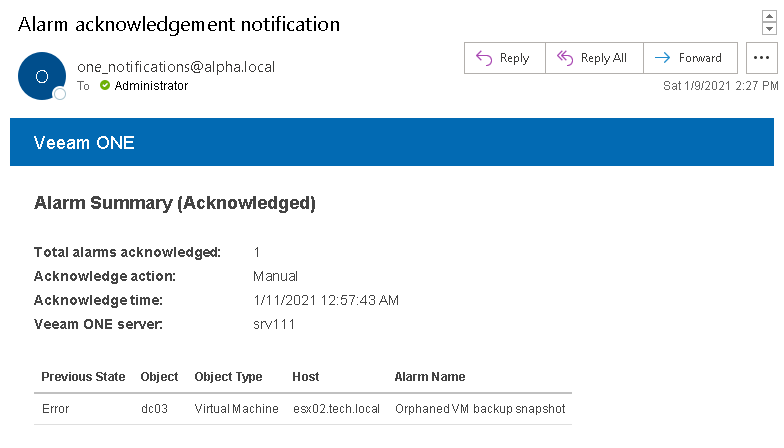

# Notifications on Acknowledged Alarms

When one or more alarms are acknowledged, Veeam ONE sends a notification to users who monitor the affected object. The notification includes information about the number of alarms acknowledged, time when the alarms were acknowledged and reason, as well as the list of acknowledged alarms.

To receive a notification about acknowledged alarms, make sure that:

* You have configured SMTP Server settings.

For details, see [Step 1. Configure SMTP Server Settings](configure_smtp_server.md).

* Your email address is included either in the default notification group, or in the list of notification recipients specified in the alarm action settings, and the notification level is set to Any state.

For details, see [Step 4. Configure Email Recipients](configure_email_recipients.md).

* Notifications about resolved and acknowledged alarms are enabled.

For details, see [Step 5. Configure Notifications About Resolved and Acknowledged Alarms](disable_resolved_alarms.md).

The following image shows an example of a notification about acknowledged alarms.

