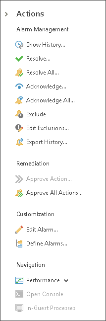
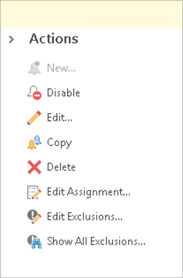

# Actions Pane

The Actions pane on the right displays links to tasks and commands that can be initiated by the user. The pane becomes available when you open the Veeam ONE Agents or Alarms tabs, or switch to the Alarm Management view. You can hide and show the pane using the collapse/expand arrows.

Options displayed on the pane depend on the object type selected in the information pane. For example, if you select a VM in the inventory pane and open the list of triggered alarms for this VM, all alarm actions, object actions, and navigation actions will be available in the Actions pane. If you select a storage object in the inventory pane, some navigation actions will become unavailable as they do not apply to storage objects. For details on working with alarm actions, see [Working with Alarms](alarms_guide.md).

In a similar manner, if you open the Alarm Management section and select the Alarm Management node in the inventory pane, the New action will become unavailable, as you must select a particular object to create a new alarm.

