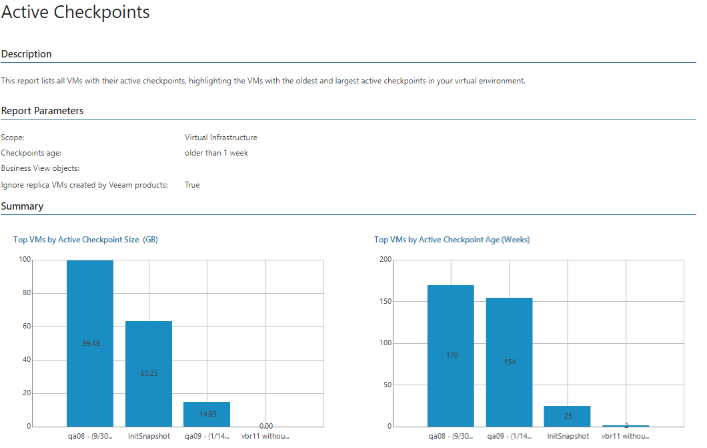
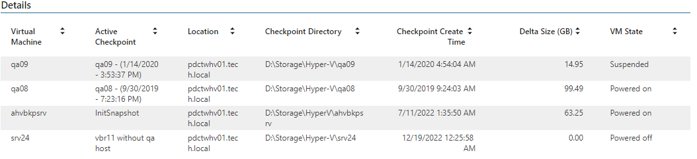

# Active Checkpoints

This report shows a list of all VMs with checkpoints, including the oldest and the largest checkpoints in the virtual environment.

* The Top VMs by Active Checkpoint Size (GB) and Top VMs by Active Checkpoints Age (Weeks) charts display top 5 VMs with the oldest and the largest checkpoints in the virtual environment.

* The Details table provides the list of VMs with checkpoints and shows checkpoint name, location, date and time when the checkpoint was created, checkpoint size and VM state.

Report Parameters

You can specify the following report parameters:

* Infrastructure objects: defines a virtual infrastructure level and its sub-components to analyze in the report.
* Business View objects: defines Business View groups to analyze in the report. The parameter options are limited to objects of the Virtual Machine type.

Business View groups from the same category are joined using Boolean OR operator, Business View groups from different categories are joined using Boolean AND operator. That is, if you select groups from the same category, the report will contain all objects that are included in groups. However, if you select groups from different categories, the report will contain only objects that are included in all selected groups.

* Checkpoint age, older than: defines checkpoint age threshold. If a VM checkpoint is older than the specified age, the VM will be included in the report.
* Ignore replica VMs created by Veeam products: defines whether VM replicas created by Veeam Backup & Replication will be excluded from the report scope.

Veeam Backup & Replication uses VM checkpoint as replica restore points. Such restore points may be large in size and remain on disk for a long period of time. If you have VM replicas created with Veeam Backup & Replication, select this check box to exclude VM replicas with checkpoint restore points from the report.

Use Case

Orphaned checkpoints consume valuable storage resources. Best practices for checkpoints recommend that you delete checkpoints older than 3 days, since they no longer reflect recent VM changes.

The report helps you detect orphaned checkpoints and better address the problem of wasted storage space.

Page updated 2026-07-17

