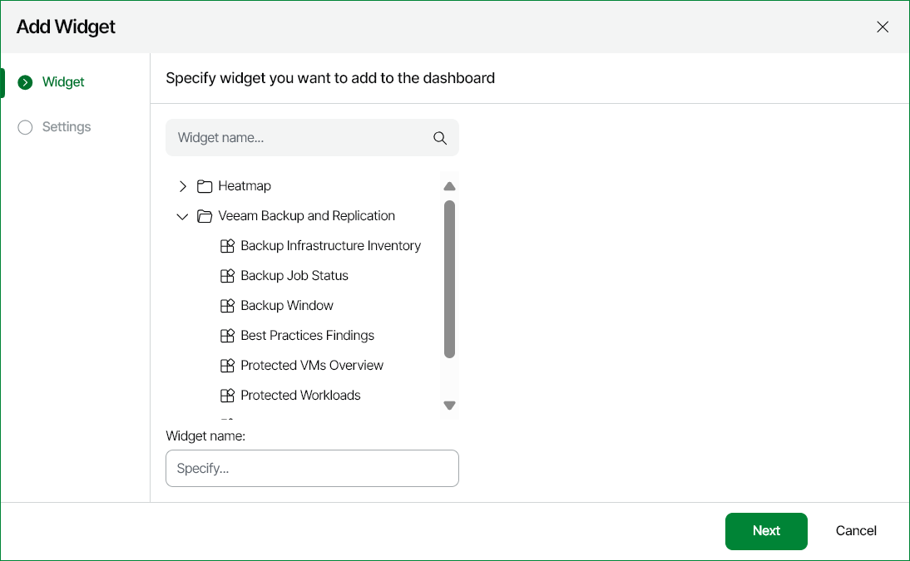
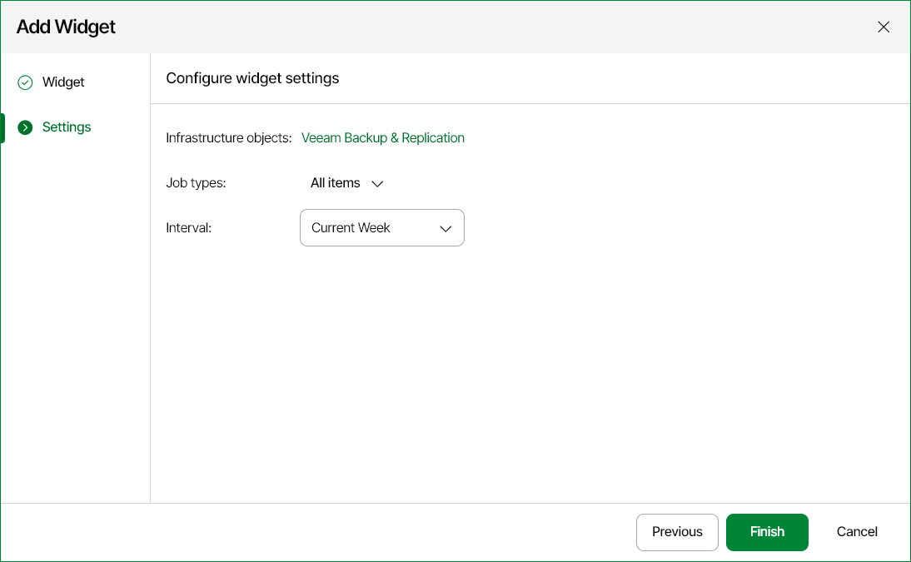
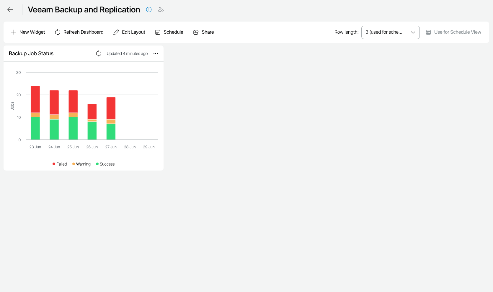

# Step 2. Add Widgets to Dashboard

After you create a new dashboard, you must add widgets to it.

Veeam ONE Web Client comes with a set of widgets packs for Veeam Backup & Replication, Veeam Backup for Microsoft 365, VMware vSphere and Microsoft Hyper-V. Widget packs include ready-to-use widgets that portray various aspects of the managed environment. You can add widgets from widget packs to custom dashboards.

To add a widget to a dashboard:

1. Open Veeam ONE Web Client.
2. Open the Dashboards section.
3. Click the dashboard preview image.
4. At the top left corner of the dashboard window, click New Widget.

Veeam ONE Web Client will launch the Add Widget wizard.

1. At the Widget step of the wizard, select a widget to add on the dashboard and specify the widget name in the Widget name field. The widget name will be displayed at the top of the widget on the dashboard.

1. At the Settings step of the wizard, define widget options, such as the scope, time interval, number of objects to display in the widget and so on.

Availability of widget options depends on the type of the selected widget.

1. Click Finish to add the widget to the dashboard.

1. Repeat steps 4–8 for each new widget you want to add to the dashboard.

