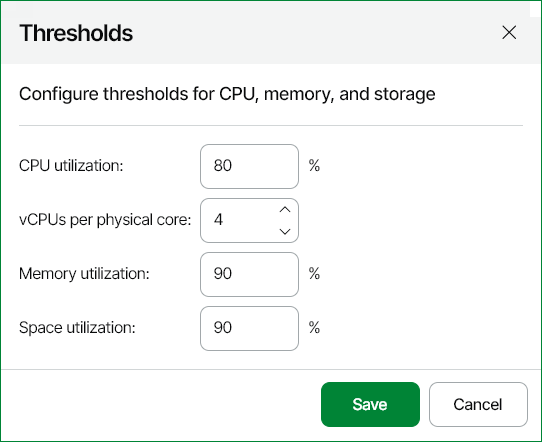

# Adjusting Performance Thresholds

Before you run a scenario simulation, you may need to examine the effective performance thresholds and change them if necessary. The thresholds describe the maximum allowable resource utilization level that must not be exceeded after the deployment project changes come into effect.

The default performance thresholds are designed to ensure conservative resource utilization and are therefore appropriate for the majority of typical capacity planning projects.

To view and change performance thresholds:

1. Open Veeam ONE Web Client.
2. Open the Deployment Projects section.
3. At the top of the list, click Thresholds.
4. Change threshold values if required:

* CPU utilization — maximum allowable processor utilization level on a physical host.
* vCPUs per physical core — maximum allowable CPU allocation ratio (the ratio of vCPU to pCPU). It is calculated as the total number of allocated virtual cores divided by the number of physical cores in the target container.
* Memory utilization — maximum allowable memory utilization level on the physical host.
* Space utilization — maximum allowable amount of used space on the target datastores.

1. Click Save.

