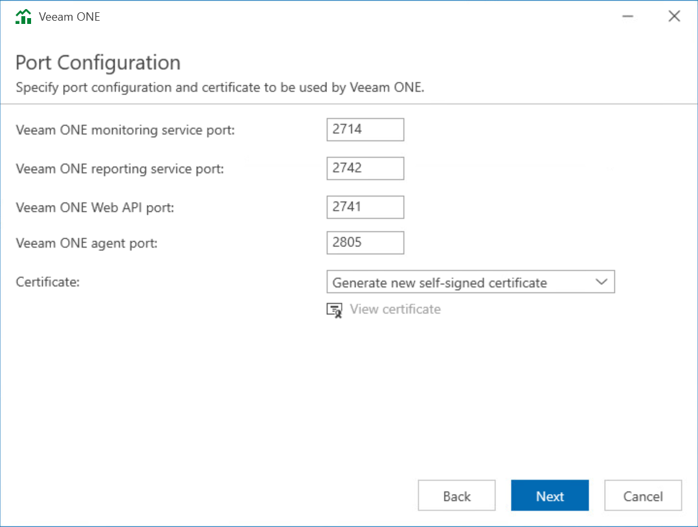

# Step 13. Specify Connection Ports

At the Port Configuration step of the wizard, specify connection settings for Veeam ONE Monitoring Service, Veeam ONE Reporting Service, internal Web API and Veeam Analytics service:

* In the Veeam ONE monitoring service port field, type a number of the port that will be used to interact with Veeam ONE Monitoring service.

The default port number is 2714.

* In the Veeam ONE reporting service port field, type a number of the port that will be used to interact with Veeam ONE Reporting service.

The default port number is 2742.

* In the Internal Web API port field, type a number of the port that will be used by Veeam ONE Monitoring service and Web Services component to interact with Veeam ONE Reporting service.

The default port number is 2741.

* In the Veeam ONE agent port field, type a number of the port that Veeam ONE Agent will use to collect data from connected Veeam Backup & Replication servers.

The default port number is 2805.

* In the Certificate list, choose a certificate that will be used to secure traffic between the web browser, Veeam ONE Web Services and Veeam ONE Reporting service.

You can choose an existing certificate installed on the machine. If the setup wizard does not find an appropriate certificate to be used, it generates a self-signed certificate.

You can change the certificate later in Veeam ONE Settings utility. For details, see [Veeam ONE Server Settings](utility_monitor.md).

