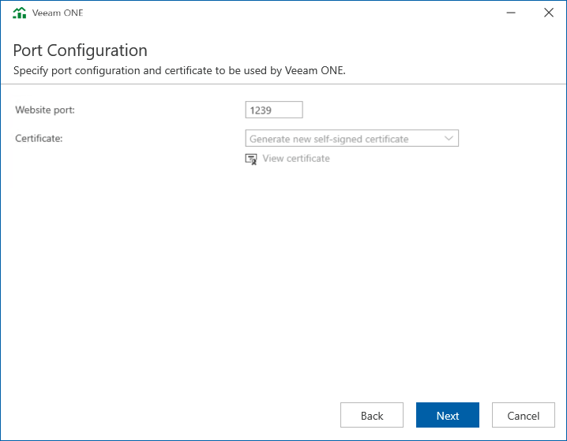

# Step 10. Specify Connection Ports

At the Port Configuration step of the wizard, specify connection settings for Veeam ONE Web Client:

* In the Website port field, type a number of the port that will be used to access the Veeam ONE Web Client through a web browser.

The default port number is 1239.

* In the Certificate list, choose a certificate that will be used to secure traffic between the Veeam ONE Web Client and a web browser.

You can choose an existing certificate installed on the machine or select the setup wizard to generate a self-signed certificate.

|  |
| --- |
| Note: |
| * If you generate or choose a self-signed certificate, you must configure a trusted connection between the Veeam ONE Web Client and a web browser later. For details, see [Accessing Veeam ONE Components](access.md#configure_trusted). * You can change the selected certificate after installation. For details, see [Change Default Certificate](upgrade_change_certificate.md). |

