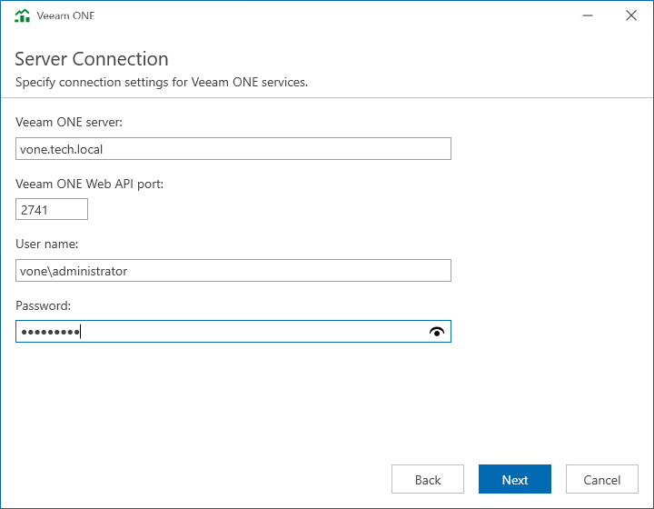

# Step 11. Specify Veeam ONE Server Connection Details

At the Server Connection step of the wizard, specify settings that the Web Services component must use to connect to the Server component:

* In the Veeam ONE server field, specify a FQDN of a machine on which you have installed the Veeam ONE Server component.
* In the Veeam ONE Web API port field, specify the number of a port that the Web Services component will use to communicate with the Veeam ONE Web API component.

The default port number is 2741.

* In the Username and Password fields, specify credentials of a user under which Veeam ONE Web Services will connect to Veeam ONE Server and configure it during installation.

The user must be a member of Veeam ONE Administrators security group on the machine where Veeam ONE Server is installed.

The user name must be specified in the DOMAIN\USERNAME format.

