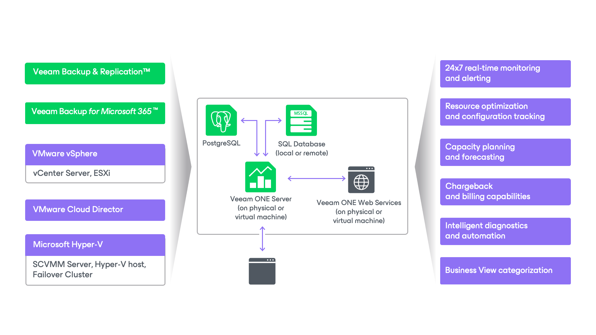

# Custom Deployment

The following diagram illustrates the custom Veeam ONE deployment scenario.

The custom deployment scenario relies on a distributed architecture where server and client parts are separated and installed on different machines (physical or virtual). In the custom deployment scenario:

* Veeam ONE Server and Veeam ONE Web Services components are installed on separate machines.

* To enable multi-user access to real-time performance statistics and configurable alarms, you can install one or more instances of Veeam ONE Client on remote machines.

* To store data retrieved from connected servers, a local or remote Microsoft SQL Server instance is required as a supporting system. If you already have a Microsoft SQL Server instance that meets Veeam ONE system requirements, you can adopt it for Veeam ONE deployment. Otherwise, you can install a new Microsoft SQL Server instance during the product installation — Veeam ONE setup package includes Microsoft SQL Server 2017 Express Edition.
* Veeam ONE 13 and above's new reporting engine requires the reporter database to be hosted on a local or remote PostgreSQL instance. You can use an existing PostgreSQL instance that meets Veeam ONE system requirements or install a new instance during product setup. Veeam ONE includes PostgreSQL 17.6 as part of the installation package. For details on Veeam ONE 13's new reporting engine, see [Viewing Reports](view_reports.md).

|  |
| --- |
| Note: |
| * For production deployments, it is recommended to use a remote Microsoft SQL Server and PostgreSQL installation. It is also recommended to run Veeam ONE services on a dedicated server. Such distributed installation will improve performance of Veeam ONE services. * If you choose to host Veeam ONE database on Microsoft SQL Server Express, consider is a 10 GB database size limitation for this edition. For details, see [Editions and Supported Features for SQL Server](https://learn.microsoft.com/en-us/sql/sql-server/editions-and-components-of-sql-server-2017?view=sql-server-2017&preserve-view=true). |

The custom installation relies on a client-server model for data collection and communication.

* Server component collects data from virtual environment, Veeam Backup & Replication and Veeam Backup for Microsoft 365 servers and stores this data in the database.
* Veeam ONE Web Services enable access to Veeam ONE web server and handle rendering of reports.
* Veeam ONE Client communicates with Veeam ONE Server directly to obtain real-time virtual infrastructure performance data and data protection statistics.

For a successful Veeam ONE deployment, it is essential that the client components are aware of the Veeam ONE Server and internal Web API location, and can connect to them to retrieve and process data.

For instructions on the custom installation procedure, see [Custom Installation](advanced_installation.md).

