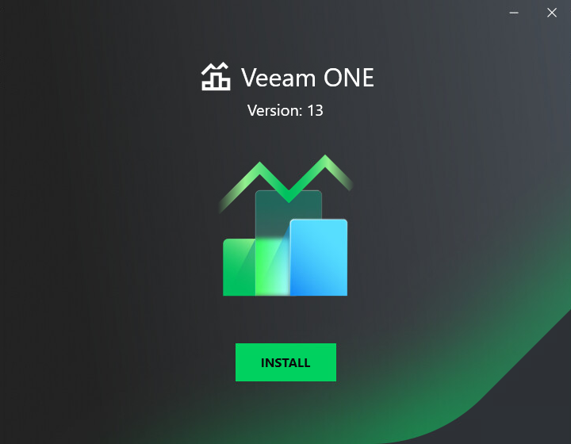

# Step 1. Launch Splash Window

After you mount or insert the disk with Veeam ONE installation image, Autorun will open a splash screen with installation options. On the splash window, click Install to launch the Veeam ONE Setup wizard.

If Autorun is disabled, run the Setup.exe file from the installation image. Alternatively, you can right-click the new disk in My Computer and select Execute Veeam ONE Autorun.

