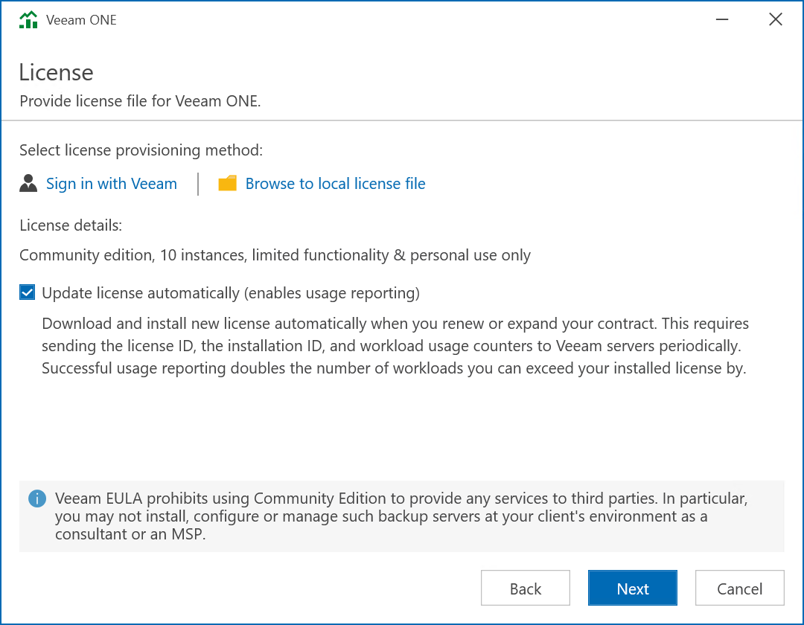

# Step 4. Provide License

At the License step of the wizard, click one of the two options to provide a license:

* Sign in with Veeam — open the Veeam account Sign in screen to log in with your Veeam account credentials if you already have a registered license on your account.
* Browse to local license file — specify the local path to the license file.

To install new licenses automatically when you renew or expand your contract, select the Update license automatically check box. If you enable the automatic license update, and therefore enable usage reporting, you will double the number of workloads by which you can exceed your installed license. Note that for Evaluation and NFR licenses automatic license update must be enabled.

