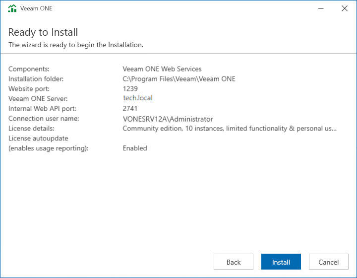

# Step 12. Review Installation Summary

At the Ready to Install step of the wizard, review installation configuration to ensure that you have provided correct settings.

Click Install to begin the installation.

When the installation completes, click Finish to close the wizard.

