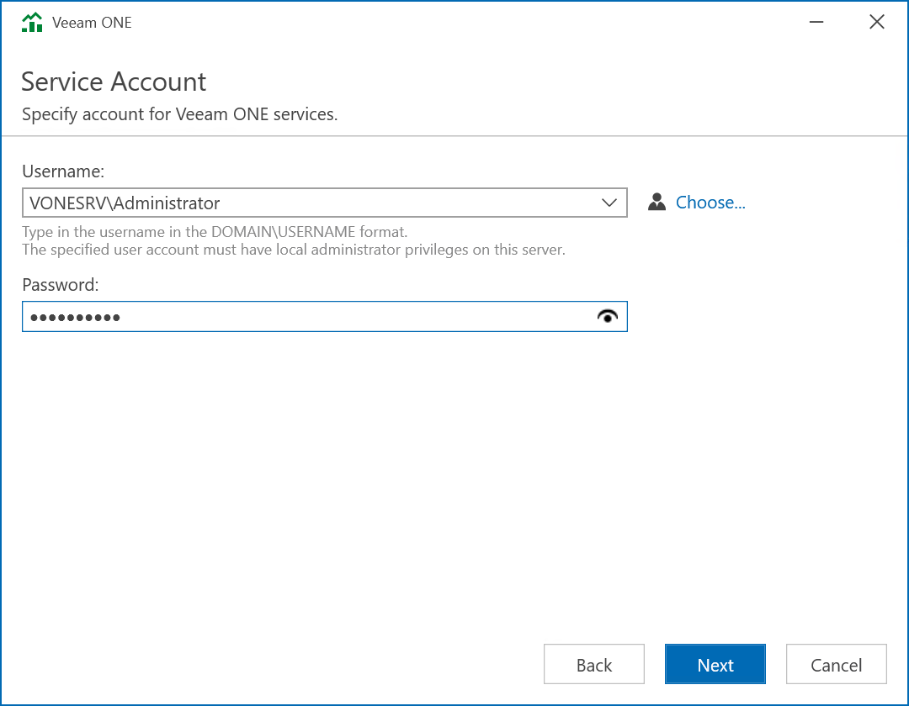

# Step 5. Specify Service Account

At the Service Account step of the wizard, specify credentials of the account under which the Veeam ONE services will run. The user name must be specified in the DOMAIN\USERNAME format. Alternatively click Choose to select an existing user account.

For details on required permissions for the service account, see [Veeam ONE Service Account](service_account.md).

