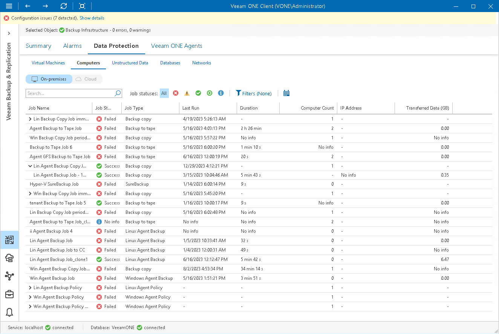

# Computers

Veeam ONE Client allows you to track Veeam backup agent jobs and policies managed by Veeam Backup & Replication servers connected to Veeam ONE.

You can view real-time job statistics at different levels of your backup infrastructure:

* Jobs managed by a specific backup server
* Jobs managed by all backup servers controlled by Veeam Backup Enterprise Manager
* All jobs across the entire backup infrastructure

Viewing Job Details

To view the list of Veeam backup agent jobs and policies at the necessary backup infrastructure level:

1. Open Veeam ONE Client.

For details, see [Accessing Veeam ONE Components](access.md).

1. At the bottom of the inventory pane, click Veeam Backup & Replication.
2. In the inventory pane, select the necessary backup infrastructure node.
3. Open the Data Protection tab and navigate to Computers.
4. To find the necessary job or policy, you can use filters at the top of the job list:

* To show or hide jobs that ended with a specific status, use the status buttons at the top of the list (Show all jobs, Show failed jobs, Show jobs with warnings, Show successful jobs, Show running jobs or Show jobs with no status).
* To show or hide jobs and policies by type, use the filters at the top of the list (Agent backup, Agent backup policy, Backup copy, Backup to tape, SureBackup, Microsoft SQL transaction log backup, Oracle Database transaction log backup, PostgreSQL transaction log backup).
* To show or hide jobs and policies by platform of Veeam backup agent, use the filters at the top of the list (Microsoft Windows, Linux, masOS, IBM AIX, Oracle Solaris).

* To set the time interval when jobs ran for the last time, use the Filter jobs by time period button. Release the button to discard the time period filter.

* To find jobs and policies by name, use the search field at the top of the list.

The list of jobs shows all Veeam backup agent jobs and policies for the backup infrastructure level that you selected in the inventory pane.

Each job in the list is described with a set of properties. To show or hide properties, right-click the list header and choose properties that must be displayed.

* Job Name — name of the job or policy.

Click the > icon to show details of agent job sessions based on a specific backup policy.

* Job Status — the latest status of the job or policy session (Success, Warning, Failed, Running, or jobs with no status).

* Backup Server — name of the backup server on which the job or policy is configured. Click the server name link to drill down to the list of alarms for a chosen backup server.

* Job Type — backup job type (Agent backup, Agent backup policy, Backup copy, Backup to tape, SureBackup, Microsoft SQL transaction log backup, Oracle Database transaction log backup, PostgreSQL transaction log backup).
* Computer — name of the computer for which the job or policy is configured.
* Last Run — date and time when the backup job was performed for the last time.
* Duration — time taken to complete the backup job during its latest run.
* Computer Count — number of computers included in the backup job.
* IP Address — IP addresses of computers to which the backup policy was applied.
* Transferred Data (GB) — amount of backup data that was transferred to the target destination during the latest job run.
* Avg. Duration (Last Month) — average time taken to complete the backup job (total job duration time for the previous month divided by the number of times the job ran).

|  |
| --- |
| Note: |
| The “No info” label indicates that no information is available for the job because data has not been collected yet. |

