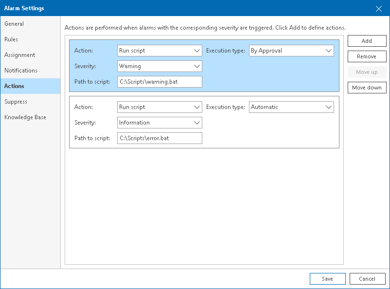

# Step 6. Specify Alarm Remediation Actions

On the Actions tab of the Alarm settings window, you can specify what actions must be performed after the alarm is triggered, or after the alarm status changes:

1. Click Add.
2. From the Action list, select Run Script.

In the Path to script field, specify the path to the script that must be executed after the alarm is triggered, or after the alarm status changes. The executable file must be placed at the location accessible for the Veeam ONE service account. The script is executed on the machine running Veeam ONE Server component. You can use the following parameters in the command line for running the script: %1 — alarm name; %2 — affected node name; %3 — date and time of alarm trigger; %4 — alarm status; %5 — affected object name; %6 — ID assigned to a combination of an affected node and an alarm.

|  |
| --- |
|  Note: |
| Predefined remediation actions are available for a number of out-of-the-box alarms only. For the list of alarms with predefined remediation actions, see [Remediation Actions](appendix_remediation.md). |

1. From the Severity list, select alarm severity level at which an action must be taken.
2. From the Resolution Type list, select resolution type — manual or automatic.

For details, see [Alarm Remediation Actions](remediation_actions.md).

1. Repeat steps 1–4 for every action you want to add to an alarm.

To change the position of an action relative to other actions, select the action and click Move up or Move down.

