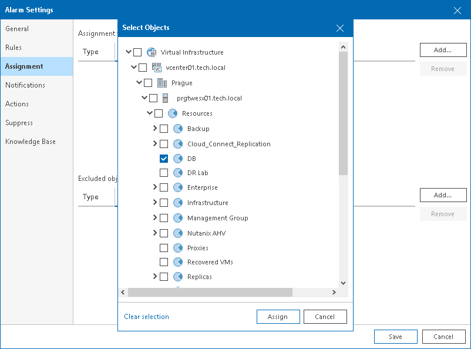
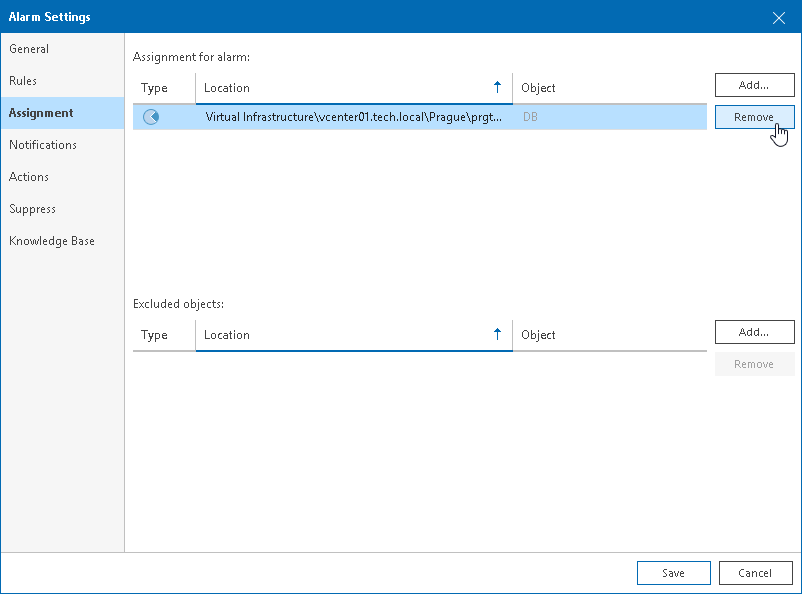
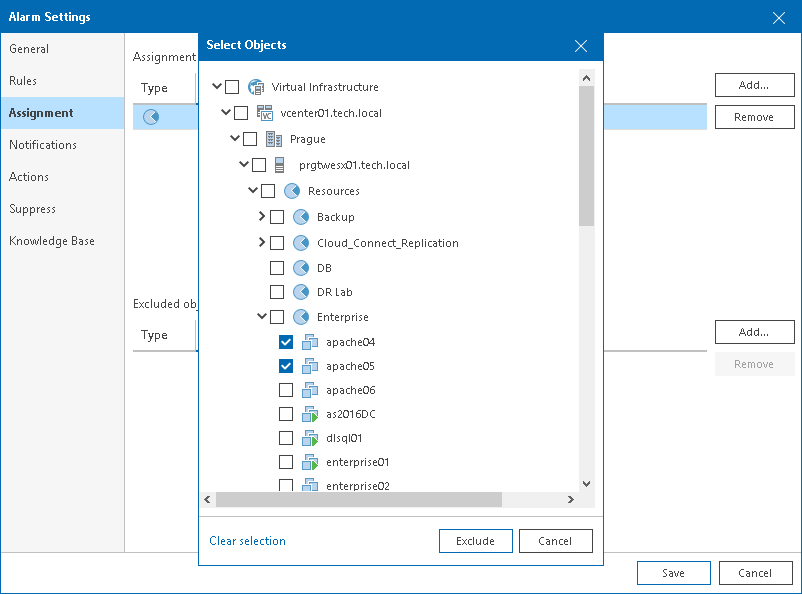

# Step 4. Specify Alarm Assignment Scope

On the Assignment tab of the Alarm settings window, specify one or more infrastructure objects to which the alarm must be assigned.

Adding Objects to Alarm Assignment Scope

To add one or more objects to alarm assignment scope:

1. On the Assignment tab, in the Assignment for alarm section, click Add and select the necessary node (Veeam Backup & Replication, Veeam Backup for Microsoft 365, Virtual Infrastructure, VMware Cloud Director, Business View).
2. In the Assign Alarm window, select check boxes next to objects to which you want to assign the alarm.
3. Click Assign.

To remove an object from the alarm assignment:

1. On the Assignment tab, in the Assignment for alarm section, select an object you want to remove from the assignment.
2. On the right, click Remove.

Excluding Objects from Alarm Assignment Scope

You can exclude objects from alarm assignment scope:

1. On the Assignment tab, in the Excluded objects section, click Add and select the necessary node (Veeam Backup & Replication, Veeam Backup for Microsoft 365, Virtual Infrastructure, VMware Cloud Director, Business View).
2. In the Exclude Alarm window, select check boxes next to objects you want to exclude from alarm assignment.
3. Click Exclude.

Page updated 2026-07-31

