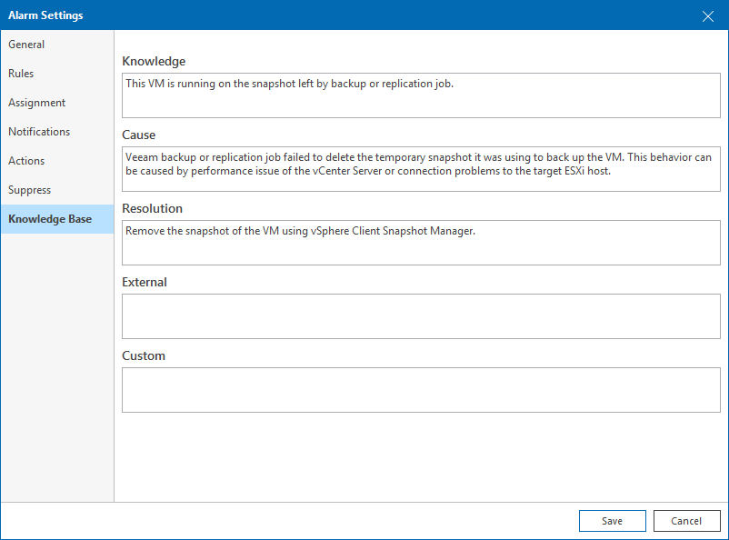

# Step 8. Specify Alarm Details

On the Knowledge base tab of the Alarm settings window, specify alarm details. Alarm details are displayed when you select the alarm in the Alarm Management view or on the Alarms monitoring dashboard in Veeam ONE Client, and included in alarm email notifications.

1. In the Knowledge, Cause and Resolution fields, specify alarm details, what could cause the alarm, and steps to resolve the alarm.
2. In the External field, provide links to external resources containing reference information, such as [VMware vSphere Documentation](https://docs.vmware.com/en/VMware-vSphere/index.html) or [Microsoft documentation](https://learn.microsoft.com/en-us/).
3. In the Custom field, specify additional information, such as comments or additional instructions.

