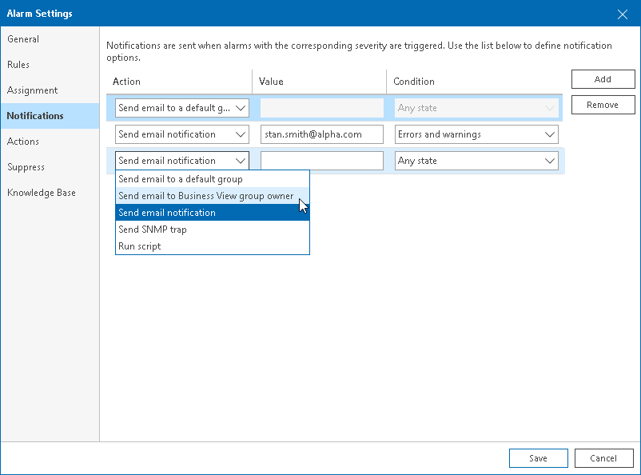

# Step 5. Specify Alarm Notification Options

On the Notifications tab of the Alarm settings window, you can specify what actions must be performed after the alarm is triggered, or after the alarm status changes. You can choose to notify virtual infrastructure administrators by email, send SNMP traps or run a custom script.

|  |
| --- |
|  Note: |
| To receive email and trap notifications, you must first configure email and trap notification settings in the Veeam ONE Client Configuration Wizard or in Veeam ONE Client server settings. To learn how to configure notification settings for alarms, see [Configuring Alarm Notifications](configure_alarm_notification.md). |

To define alarm response actions:

1. From the Action list, select the action you want to perform:

* Send email to a default group — select this option if you want to send an email notification to all recipients included in the default email notification group when the alarm is triggered or when the alarm status changes. This is the default action that applies to all new and predefined alarms.

For details, see [Configuring Email Notifications](email_notifications.md).

* Send email to Business View group owner — select this option if you want to send an email notification an owner of a Business View group to which the object is included.

To receive notifications, you must specify an email address of a group owner in the Business View group settings. For details, see [Configuring Multiple-Condition Categorization](bv_multiple_condition.md).

* Send email notification — select this option if you want to send an email notification to specific recipients when the alarm is triggered or when the alarm status changes. In the Value field, enter recipients email addresses. If you want to specify several recipients, separate email addresses with a semicolon (;), comma (,) or space ( ).

For more information, see [Configuring Email Notifications](email_notifications.md).

* Send SNMP trap — select this option if you want to send a Simple Network Management Protocol (SNMP) trap when the alarm is triggered or when the alarm status changes.

For details, see [Configuring SNMP Traps](snmp_traps.md).

* Run script — select this option if you want to run a custom script when the alarm is triggered or when the alarm status changes. By running a script, you can automate routine tasks that you normally perform when specific alarms fire. For example, if a critical system is affected, you may need to immediately open a ticket with the in-house support or perform corrective actions that will eliminate the problem.

In the Value field, specify the path to the executable file. The executable file must be located on the machine running the Veeam ONE Server component. You can use the following parameters in the command line for running the script: %1 — alarm name; %2 — affected node name; %3 — alarm summary; %4 — date and time of alarm trigger; %5 — alarm status; %6 — previous alarm status; %7 — ID assigned to a combination of an affected node and an alarm; %8 — type of a child alarm object.

1. In the Condition field, specify when the action must be performed:

* Errors and warnings — select this option if the action must be performed every time when the alarm status changes to Error or Warning.
* Errors only — select this option if the action must be performed every time when the alarm status changes to Error.
* Resolved — select this option if the action must be performed every time when the alarm status changes to Resolved.
* Any state — select this option if the action must be performed every time when the alarm status changes to Error, Warning or Resolved.

You can specify multiple response actions for the same alarm. To add a new action, click the Add button and repeat steps 1-2 for every new action.

