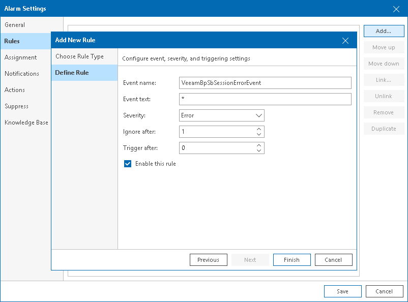

# Adding Event-Based Rules

Alarms with event-based rules alert about specific events that occur in your backup or virtual infrastructure. These can be events issued by the hypervisor or Veeam Backup & Replication events.

To add an event-based rule:

1. On the Rules tab, click Add.
2. At the Choose Rule Type step of the wizard, select Event-based rule.
3. At the Define Rule step of the wizard, specify rule settings:

1. In the Event name field, specify the name of the event that must trigger the alarm.

For the list of Veeam Backup & Replication and Veeam Backup for Microsoft 365 events, see sections [Veeam Backup & Replication Alarms](backup_alarms_events.md) and [Veeam Backup for Microsoft 365 Alarms](vbm_alarms_events.md). For the list of virtual infrastructure events, see [VMware vSphere Documentation](https://docs.vmware.com/en/VMware-vSphere/index.html) or [Microsoft documentation](https://learn.microsoft.com/en-us/).

Note that for VMware vSphere events, you must provide their names without prefixes. For example, for the vim.event.VmReconfiguredEvent event, you must specify only the VmReconfiguredEvent part.

1. In the Event text field, specify one or more keywords that an event description must contain. This can be a name of a user who initiated an action, a name of a changed object, or a specific action.

You can use the ‘\*’ (asterisk) and ‘?’ (question) wildcards in the Event name and Event text fields. The ‘\*’ (asterisk) character stands for zero or more characters. The ‘?’ (question mark) stands for a single character.

For example, if you want to receive notifications when users reconfigure VMs on the host.domain.local host, in the Event name field, specify VmReconfiguredEvent, and in the Event text field, specify ‘reconfigured \* on host.domain.local’. Here the ‘\*’ (asterisk) replaces a name of a reconfigured VM. As a result, the alarm will be triggered each time any user reconfigures any VM on the host.

1. Specify the alarm severity level for the rule.

For details, see [Alarm Severity](severity.md).

1. In the Ignore after field, enter the number of times the alarm for the same event or condition must be triggered. All further repetitive alarms are suppressed.

For example, an alarm is configured to fire when a host loses its network connection, and the Ignore after value is set to 1. If a host loses its network connection, an event informing about connection loss will be raised by the hypervisor, and Veeam ONE will trigger an alarm. All further events informing about problems with host network connectivity will be ignored until you resolve the alarm that has already been triggered.

If you want the alarm to trigger every time an event or condition occurs, set the Ignore after value to 0.

1. In the Trigger after field, enter the number of times an event must repeat before Veeam ONE must trigger an alarm.

By default, this value is set to 0, which means that Veeam ONE must trigger an alarm after the first event occurrence.

1. If you want to put the rule in action for the alarm, make sure that the Enable this rule check box is selected.

If you clear this check box, the rule settings will be saved, but the rule will be disregarded.

1. Click Finish.

1. Repeat steps 1–4 for every event-based rule you want to add.

