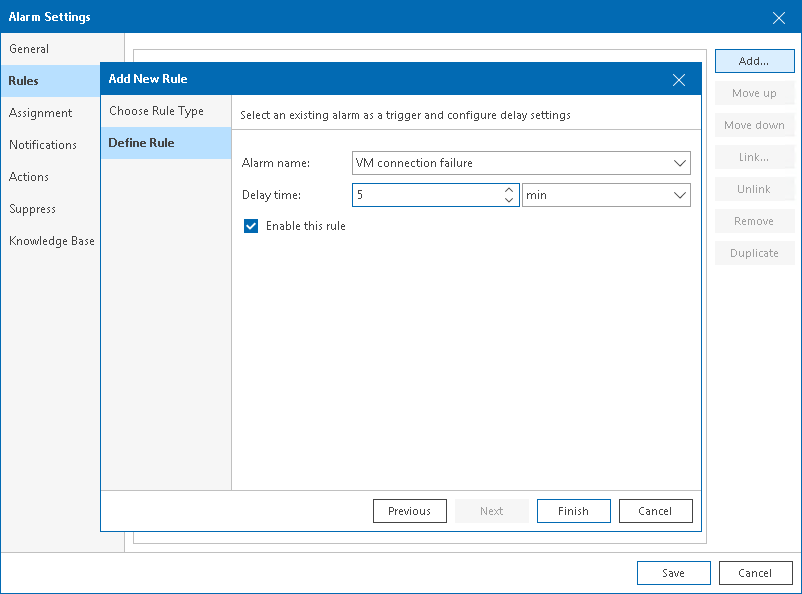

# Adding Rules Based on Existing Alarms

You can add to an alarm rules that are based on existing alarms. These rules alert if the specified alarms trigger or change their status.

To add a rule based on existing alarm:

1. On the Rules tab, click Add.
2. At the Choose Rule Type step of the wizard, select Existing alarm.
3. At the Define Rule step of the wizard, specify rule settings:

1. In the Alarm name field, specify the name of the existing alarm that must trigger an alarm.

This can be a predefined or custom alarm. For a list of predefined alarms, see the [Predefined Alarms](appendix_alarms.md) section.

1. In the Delay time field, specify the period that must pass between triggering the source and the target alarm.

You can specify the delay time in minutes, hours, or days.

1. If you want to put the rule in action for the alarm, make sure that the Enable this rule check box is selected.

If you unselect this check box, the rule settings will be saved, but the rule will be disregarded.

1. Click Finish.

1. Repeat steps 1–4 for every alarm-based rule you want to add.

