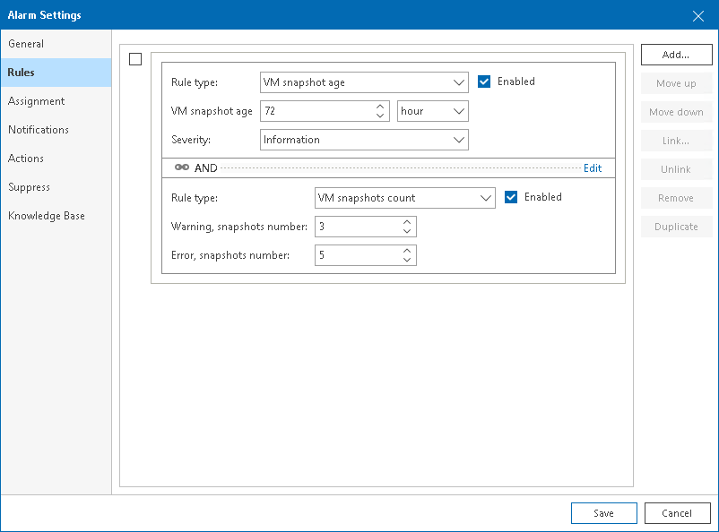
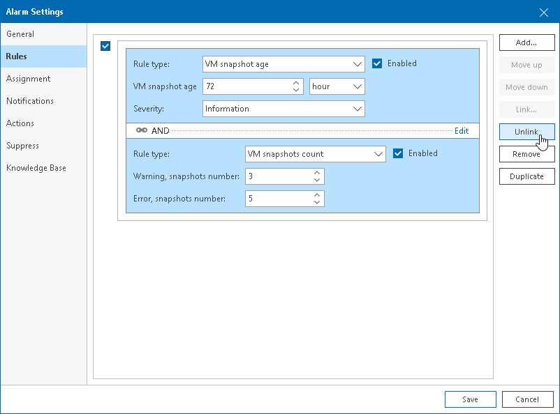

# Linking Rules

If you add multiple rules to one alarm, Veeam ONE will trigger the alarm when conditions for at least one rule are met. You can change the default way of evaluating alarm rules and link rules using Boolean AND or OR operators. For example, if an alarm must be triggered when conditions for two rules are met simultaneously, you can link these rules with Boolean AND.

To link alarm rules:

1. Choose the rules you want to link and place them one after another. You cannot link rules that do not follow one another in the list. For example, you cannot link the first and the fifth rule.

To move a rule one position up, select the check box next to the rule and click Move up. To move a rule one position down, select the check box next to the rule and click Move down.

1. Select check boxes next to rules you want to link, and click Link on the right.
2. In the Rule condition window, select a condition:

* AND — if rules are linked with this operator, the alarm is triggered when conditions for all linked rules are met.
* OR — if rules are linked with this operator, the alarm is triggered when a condition for any of the linked rules is met.

1. Click Apply.

After you link two or more rules, Veeam ONE will display a dotted line and a linking condition between the rules. Linking supports 3 levels of nesting.

To unlink rules:

1. Select the check box next to the linked rules.
2. On the right, click Unlink.

If you unlink rules, the alarm will be triggered each time when conditions for any alarm rule are met.

Page updated 2026-07-17

