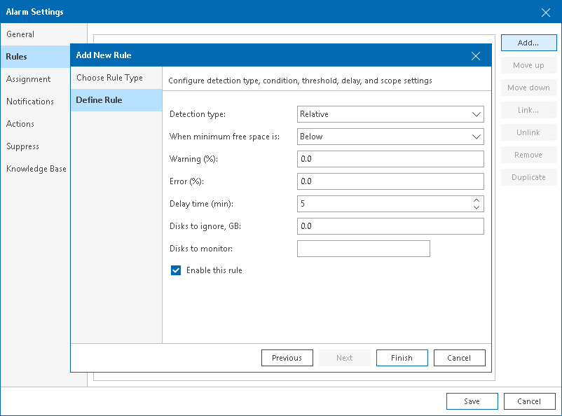

# Adding State-Based Rules

Alarms with state or condition-based rules alert about the important condition or state changes.

To add a rule for a specific condition or state change:

1. On the Rules tab, click Add.
2. At the Choose Rule Type step of the wizard, select the necessary trigger type.
3. Click Next and select the necessary rule condition.

Available options depend on the alarm type. For the full list of alarm rules, see [Alarm Rules Reference](appendix_rules_alarms.md).

1. At the Define Rule step of the wizard, specify conditions (or other settings, as applicable) for the alarm rule.
2. Specify alarm severity.

For details, see [Alarm Severity](severity.md).

1. If you want to put the rule in action for the alarm, make sure that the Enable this rule check box is selected.

If you clear this check box, the rule settings will be saved, but the rule will be disregarded.

1. Click Finish.

1. Repeat steps 1–7 for every state-based rule you want to add to an alarm.

