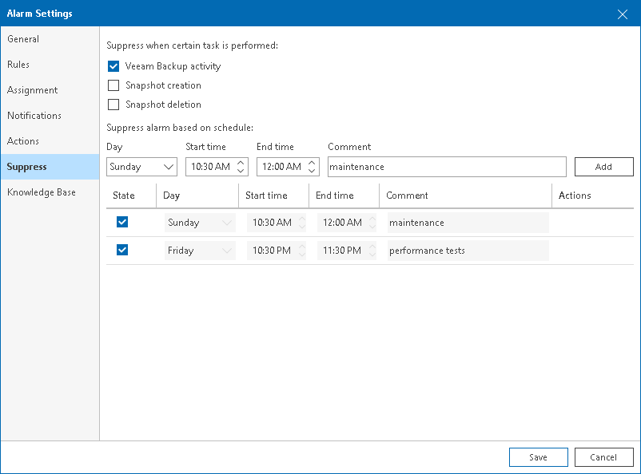

# Step 7. Configure Alarm Suppression Settings

To automatically suppress alarms that occur under specific conditions or during a specific time interval, you can configure alarm suppression settings. For example, alarms informing about high resource utilization may need to be suppressed if these alarms occur during a scheduled resource-consuming operation (such as backup performed with Veeam Backup & Replication or other operations).

For suppressed alarms, Veeam ONE does not show any notifications and does not perform any response actions. If the object stays affected by the end of the suppression period, Veeam ONE will trigger the alarm and perform the alarm response actions.

On the Suppress tab of the Alarm settings window, specify alarm suppression settings.

Suppressing Alarms During Events

To suppress the alarm under specific conditions or when a specific event occurs, choose one of the following options:

* Veeam Backup activity — suppresses the alarm when Veeam Backup & Replication jobs are running. Veeam ONE detects which VMs are being processed and does not trigger alarms for these VMs and associated hosts and datastores.

For example, if you select Veeam Backup activity check box for the VM CPU Usage alarm, this alarm will be suppressed for all VMs that are being backed up or replicated — until the jobs finish processing these VMs.

If you select the Veeam Backup activity check box for the Host CPU Usage alarm, this alarm will be suppressed for the entire host where at least one VM is being backed up or replicated — until the jobs are finished.

* Snapshot creation — suppresses the alarm during snapshot creation for the object itself or its parent objects.

For example, if you create an alarm for a VM, the alarm will be suppressed for a VM while a hypervisor creates a snapshot. If you create an alarm for a host, the alarm will be suppressed for the host while a snapshot is being created for any VM on this host.

* Snapshot deletion — suppresses the alarm during snapshot deletion for the object itself or its parent objects.

For example, if you create an alarm for a VM, the alarm will be suppressed for a VM while a hypervisor deletes a snapshot. If you create an alarm for a host, the alarm will be suppressed for the host while a snapshot is being deleted for any VM on this host.

|  |
| --- |
|  Note: |
| * The Veeam Backup activity suppression option apply to VMware vSphere and Microsoft Hyper-V alarms only. To enable the Veeam Backup activity option, make sure that you connected a Veeam Backup & Replication server to Veeam ONE. Otherwise, alarms will not be suppressed during Veeam Backup & Replication activity.  * Snapshot creation and Snapshot deletion suppression options apply to VMware vSphere alarms only. |

Scheduled Alarm Suppression

To suppress the alarm according to a specific schedule during the week:

1. Select the Suppress alarm based on schedule option.
2. Specify time intervals on specific weekdays during which the alarm must be suppressed.

You can add more than one record for one weekday. Note that the time intervals specified for the same day must not intersect.

Page updated 2026-08-07

