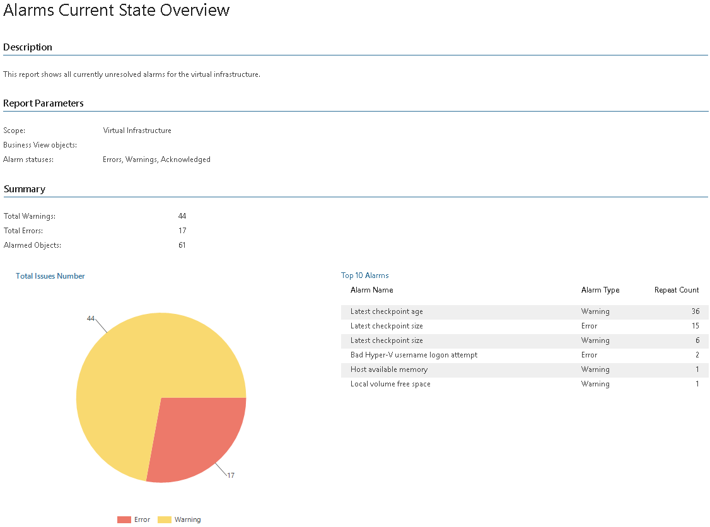

# Alarms Current State Overview (Hyper-V)

This report shows alarms triggered by Veeam ONE Client for the managed virtual infrastructure.

* The Summary section includes the following elements:

+ The Total Issues Number chart shows the number of triggered alarms.

+ The Top 10 Alarms table shows 10 most frequently triggered alarms.

* The Details section provides information on each triggered alarm, including affected object, location, alarm name, alarm type, trigger and date and time when the alarm was triggered.

Report Parameters

You can specify the following report parameters:

* Infrastructure objects: defines a virtual infrastructure level and its sub-components to analyze in the report.
* Business View objects: defines Business View groups to analyze in the report.

Business View groups from the same category are joined using Boolean OR operator, Business View groups from different categories are joined using Boolean AND operator. That is, if you select groups from the same category, the report will contain all objects that are included in groups. However, if you select groups from different categories, the report will contain only objects that are included in all selected groups.

* Alarm statuses: defines the status of alarms that must be included in the report (Error; Error and Warning; Error, Warning, Acknowledged; Acknowledged).

Use Case

This report evaluates the health state of the managed infrastructure and helps you simplify troubleshooting. You can use the report to export details of triggered alarms.

