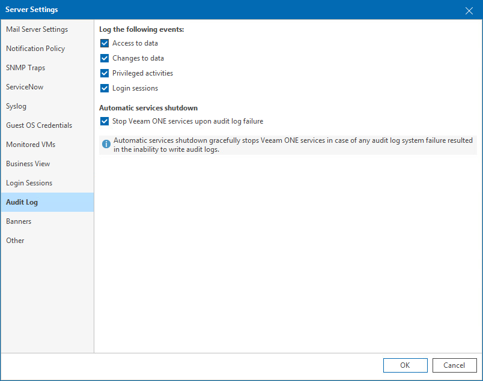

# Audit Log

In the audit log settings, you can select which user activities in Veeam ONE Client and Veeam ONE Web Client must be logged and enable automatic shutdown of Veeam ONE services.

To configure audit log settings:

1. Open Veeam ONE Client.

For details, see [Accessing Veeam ONE Components](access.md).

1. In the main menu, click Settings > Server Settings.

Alternatively, press [CTRL + S] on the keyboard.

1. In the Server Settings window, open the Audit Log tab.
2. Select which events you want to log:

* Access to data — fill this check box to log data access events, for example, switching tabs or opening dialogs.
* Changes to data — fill this check box to log data modification events, for example, changing Veeam ONE Server settings, report parameters or modifying tree view settings.
* Privileged activities — fill this check box to log administrative events, for example, managing Veeam Analytics service, updating a license or starting data collection.
* Login sessions — fill this check box to log user sessions in Veeam ONE Client and Veeam ONE Web Client.

1. If you want to shut down Veeam ONE services in case Veeam ONE is unable to write audit logs, fill the Stop Veeam ONE services upon audit log failure check box.

If events cannot be written to Windows Event Log, Veeam ONE will trigger the Audit log failure alarm and gracefully shut down Veeam ONE services.

