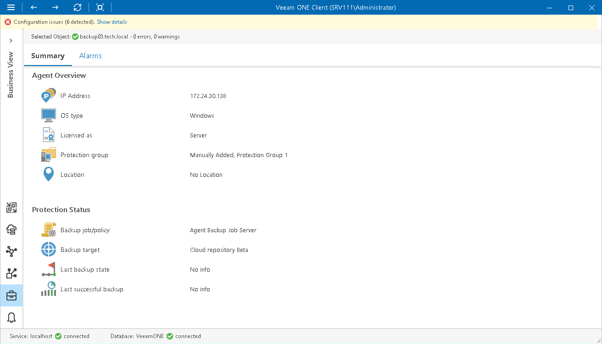

# Computer Details

The Summary dashboard for a single computer node presents an overview and protection status details for computers running Veeam Agent for Microsoft Windows, Veeam Agent for Linux, Veeam Agent for Mac and Veeam Agent for Unix.

Agent Overview

The section provides the following details:

* IP address of the computer running Veeam Agent for Microsoft Windows, Veeam Agent for Linux, Veeam Agent for Mac or Veeam Agent for Unix
* Type of an OS installed on the computer (Windows, Linux, macOS, UNIX)
* Operation mode in which the computer is licensed
* Name of the protection group in which the computer is included
* Location of the computer, as specified in Veeam Backup & Replication

Protection Status

The section provides the following details:

* Name of the backup policy applied to the computer, or the backup job in which a computer is included
* Target location in which computer backups are stored
* The latest status of the backup job session (Success, Warning, Failed, Running, No Info)
* Date and time when the latest successful backup was created for the computer

Page updated 2026-07-30

