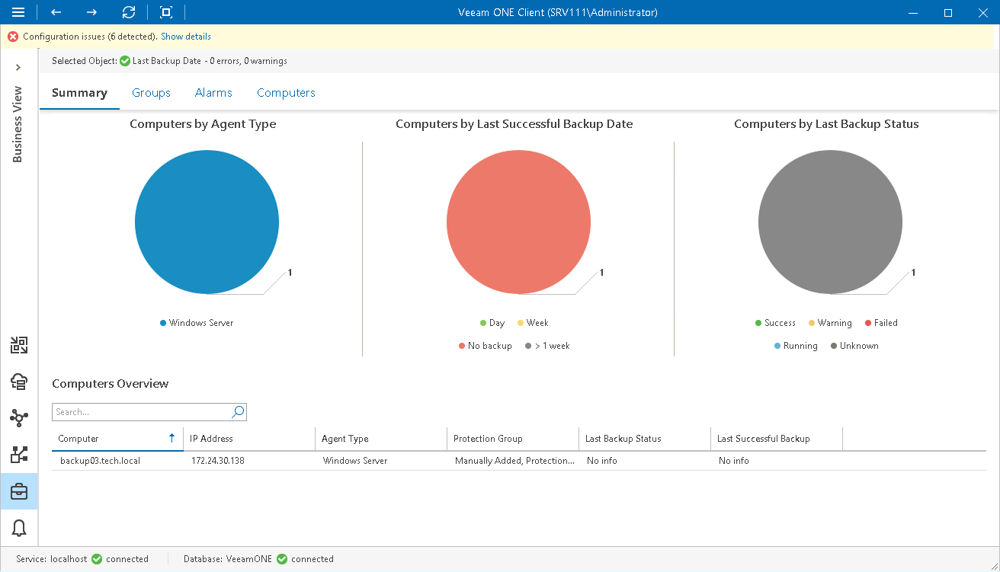

# Computers Summary

The Computers summary dashboard presents the health status overview for computers protected with Veeam Agent for Microsoft Windows, Veeam Agent for Linux, Veeam Agent for Mac and Veeam Agent for Unix. The dashboard scope includes computers whose backups are managed by Veeam Backup & Replication servers that you monitor in Veeam ONE.

The dashboard is available for different levels of the categorization model:

* For the Computers node, the dashboard presents all computers from the monitored infrastructure
* For the category node, the dashboard to presents computers included in groups within the selected category

Computers by Agent Type

The chart displays types of computers protected with Veeam Agent for Microsoft Windows, Veeam Agent for Linux, Veeam Agent for Mac and Veeam Agent for Unix.

Every chart segment shows the number of computers of a specific platform and type — the number of managed Windows servers, the number of managed Windows workstations, the number of managed Linux servers, the number of managed Linux workstations, the number of managed Mac servers, the number of managed Mac workstations, the number of managed AIX servers, the number of managed Solaris servers.

Computers by Last Successful Backup Date

The chart displays the time interval when the latest successful backup was created for computers running Veeam Agent for Microsoft Windows, Veeam Agent for Linux, Veeam Agent for Mac and Veeam Agent for Unix.

Every chart segment shows the number of computers with last successful backups created within a specific interval — the number of computers with backups created not older than a day ago, computers with backups created not older than a week ago, computers with backups older than a week, and computers with no backups.

Computers by Last Backup Status

The chart displays the latest status of backup jobs for computers running Veeam Agent for Microsoft Windows, Veeam Agent for Linux, Veeam Agent for Mac and Veeam Agent for Unix.

Every chart segment shows how many jobs ended with a specific status — failed jobs, jobs that ended with warnings, successfully performed jobs, jobs that are currently running, and jobs whose status is unknown.

Computers Overview

The table provides details on computers running Veeam Agent for Microsoft Windows, Veeam Agent for Linux, Veeam Agent for Mac and Veeam Agent for Unix:

* Computer — computer name.

* IP Address — computer IP address.
* Agent Type — operation mode of a backup agent on the computer (Windows server, Windows workstation, Linux Server, Linux Workstation, Mac Server, Mac Workstation, AIX Server, Solaris Server).
* Protection Group — name of a protection group in which the computer is included.

* Last Backup State — the latest status of a backup job (Success, Warning, Failed, Running, No Info).
* Last Successful Backup — date and time when the latest successful backup was created for the computer.

Page updated 2026-07-29

