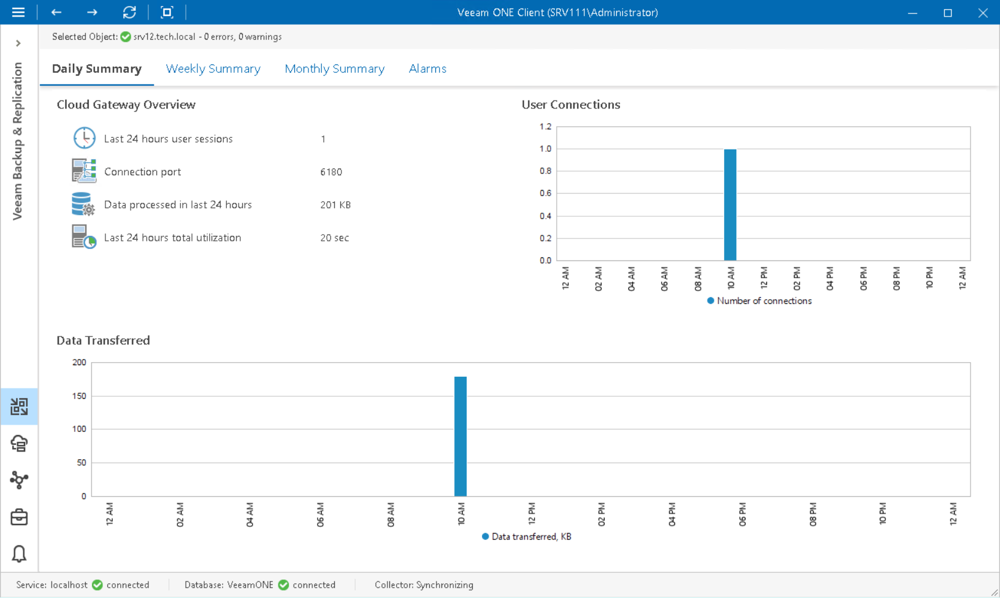

# Cloud Gateway Summary

The cloud gateway summary dashboard provides overview information and performance analysis for the chosen gateway over the past day, week or month.

Cloud Gateway Overview

The section outlines the following details:

* Number of users that connected to the gateway over the past day, week or month
* Port configured for external connections on the cloud gateway
* Amount of backup data that the cloud gateway processed over the last 24 hours, 7 days or month
* Amount of time that the cloud gateway was retrieving, processing and transferring data

User Connections/Sessions

The chart shows how many times the connection to the cloud gateway was established to transfer backup traffic over the past period.

Data Transferred/Processed Data

The chart shows the amount of backup data that the cloud gateway transferred to the cloud repository over the past period. The chart can help you measure the total amount of backup traffic coming through the cloud gateway.

[Weekly/Monthly Summary] Utilization

The chart allows you to estimate how ‘busy’ the cloud gateway was during the past period. The chart shows the cumulative amount of time that the cloud gateway was retrieving, processing and transferring backup data.

The chart can help you reveal possible resource bottlenecks. If the utilization graph on the chart is abnormally large, this can evidence of high CPU load or insufficient throughput.

