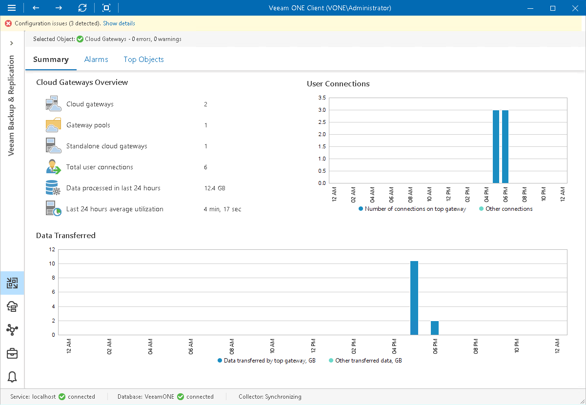

# Cloud Gateways Overview

The summary dashboard for the Cloud Gateways node presents a configuration overview and performance analysis for cloud gateways managed by a backup server.

Cloud Gateways Overview

The section provides the following details:

* Number of cloud gateways managed by the backup server
* Number of gateway pools configured on the backup server
* Number of standalone cloud gateways configured on the backup server
* Number of connections to the gateways over the past 24 hours
* Amount of backup data that was transferred through all cloud gateways
* Average amount of time during which the gateways were utilized over the past 24 hours

User Connections

The chart shows the most loaded cloud gateways in terms of user connections. The chart shows the number of connections to the most utilized gateways, as well as connections to other gateways.

To draw the chart, Veeam ONE calculates how many connections were established to each cloud gateway over the past 24 hours.

Data Transferred

The chart shows the amount of data transferred by the most utilized gateways, as well as data transferred by other gateways.

The chart can help you detect cloud gateways that transfer the greatest amount of backup data and estimate the load on gateways.

