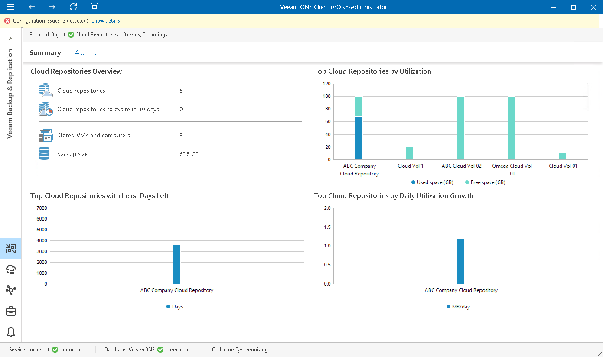

# Cloud Repositories Overview

The summary dashboard for the Cloud Repositories node presents a configuration overview and storage utilization analysis for cloud repositories (repositories allocated for users by Veeam Cloud Connect Service Providers).

Cloud Repositories Overview

The section provides the following details:

* Number of cloud repositories created for Veeam Cloud Connect users
* Number of cloud repository leases that will expire within 30 days
* Number of VMs and computers whose data is stored in backups on cloud repositories
* Cumulative amount of storage space occupied by VM and computer backups on all managed cloud repositories

Top Cloud Repositories by Utilization

The chart shows 5 cloud repositories with the greatest amount of used storage space.

For every repository in the chart, you can see the amount of used storage space against the amount of available space. If free space on the repository is running low, you may need to increase the repository quota.

Top Cloud Repositories with Least Days Left

The chart shows 5 cloud repositories that can run low on storage space sooner than others. To draw the chart, Veeam ONE analyzes historical data and checks how fast free space on repositories has been decreasing in the past. Veeam ONE uses historical statistics to forecast how soon the repository will run out of space.

Top Cloud Repositories by Daily Utilization Growth

The chart allows you to detect how fast the amount of used space on repositories increased over the past 7 days. For every repository, the chart shows the daily disk space growth usage rate (the average increase in GB per day).

Page updated 2026-07-30

