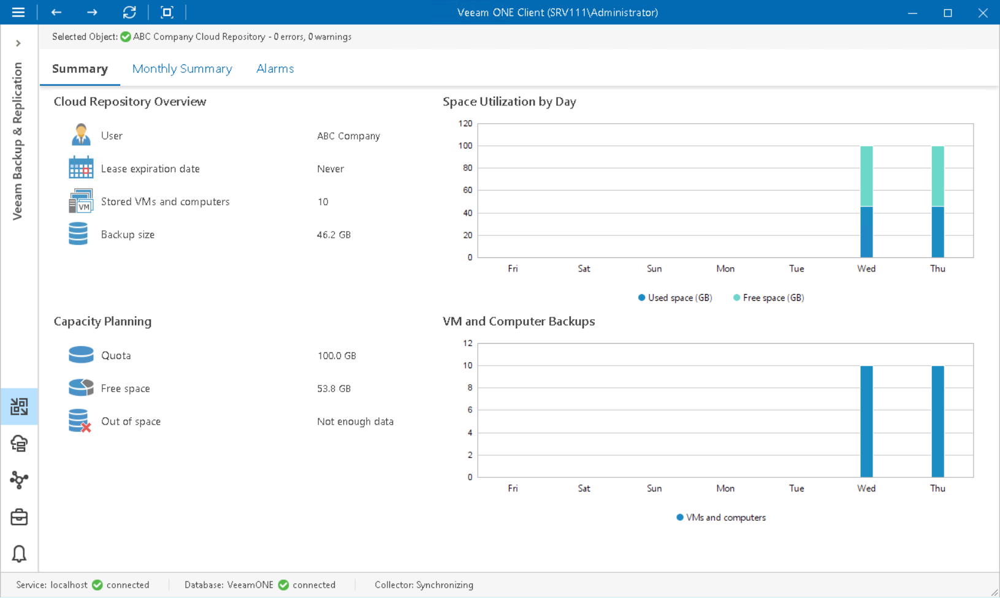

# Cloud Repository Summary

The cloud repository summary dashboard provides overview details and space utilization analysis for the chosen cloud repository (repository allocated for a user by a Veeam Cloud Connect Service Provider).

Cloud Repository Overview

The section provides the following details:

* Name of the user that owns the cloud repository
* Date when the repository lease is set to expire
* Number of VMs and computers whose data is stored in backups stored on the cloud repository
* Cumulative amount of storage space occupied by VM and computer backups on the cloud repository

Capacity Planning

The section outlines the following details:

* User quota, that is the amount of space allocated to a user
* Amount of free storage space on the cloud repository
* Number of days before the cloud repository runs out of free space

To forecast the value, Veeam ONE uses a trend that is calculated based on historical statistics — it analyzes how fast the amount of free space on the repository was decreasing in the past and uses historical statistics to forecast how soon the repository will run out of space.

Space Utilization by Day

The chart shows the amount of used storage space against the amount of available space on the cloud repository. If free space on the repository is running low, you may need to increase the repository quota.

VM and Computer Backups

The chart shows the number of VMs and computers whose backups were written to the repository during the past period.

Page updated 2026-08-05

