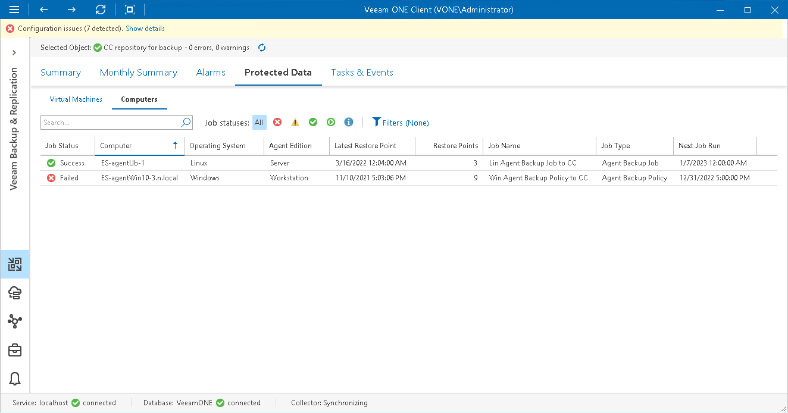

# Computers

To view the list of computers stored in backups on repositories:

1. Open Veeam ONE Client.

For details, see [Accessing Veeam ONE Components](access.md).

1. At the bottom of the inventory pane, click Veeam Backup & Replication.
2. In the inventory pane, select the necessary repository.
3. Open the Protected Data tab and navigate to Computers.
4. To quickly find computers by name, use the filters and Search field at the top of the list.

For every computer in the list, the following details are shown:

* Job Status — the latest status of the job session that created the computer backup (Success, Warning, Failed or Running).
* Computer — name of the computer stored in a backup on the repository.
* Operating System — type of computer operating system (Windows, Linux, Mac, AIX, Solaris).
* Agent Edition — mode in which the backup agent job or policy operates (Server, Workstation, Free).
* Latest Restore Point — date and time when the latest restore point was created for the computer.
* Restore Points — number of restore points created for the computer.
* Job Name — name of the backup policy, backup or backup copy job that created computer backup.
* Job Type — type of the job that created the VM backup (Agent Backup Policy, Agent Backup Job, Backup Copy).
* Next Job Run — schedule according to which the job or policy will start next time.

You can click column names to sort computers by a specific parameter. For example, to view what computers do not have recent backups, you can sort computers in the list by Latest Restore Point.

