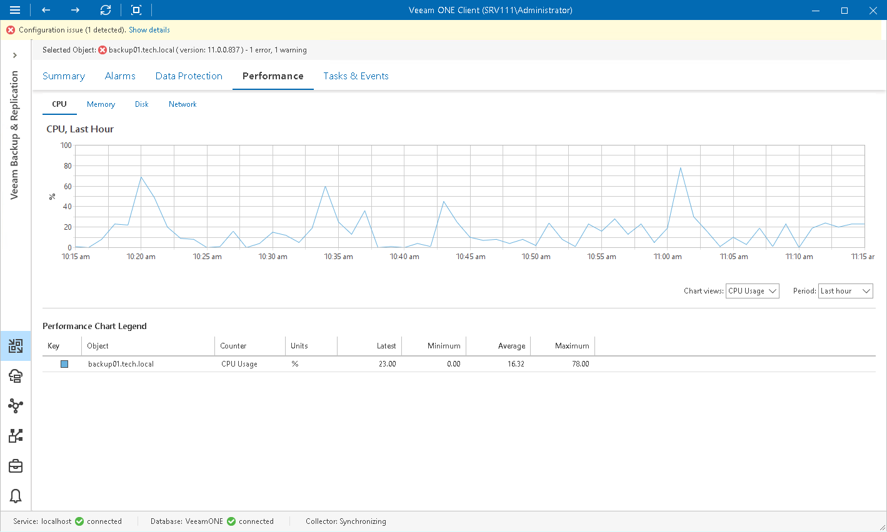

# CPU Performance Chart

The CPU chart shows the amount of used processor resources on a machine where a backup infrastructure component runs. Graphs in the CPU chart illustrate the level of processor usage for every separate CPU on the machine. The Total graph shows the cumulative processor utilization for all CPUs.

