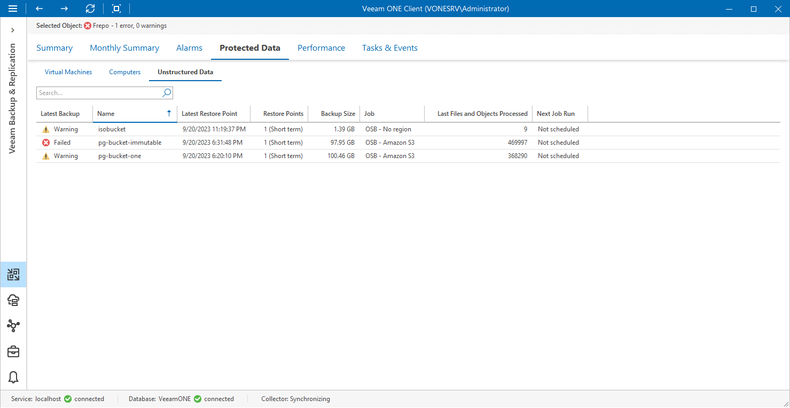

# Unstructured Data

To view the list of unstructured data stored in backups on repositories:

1. Open Veeam ONE Client.

For details, see [Accessing Veeam ONE Components](access.md).

1. At the bottom of the inventory pane, click Veeam Backup & Replication.
2. In the inventory pane, select the necessary repository.
3. Open the Protected Data tab and navigate to Unstructured Data.
4. To quickly find unstructured data by name, use the Search field at the top of the list.

For every unstructured data item in the list, the following details are shown:

* Latest Backup — the latest status of the job that created the unstructured data backup (Success, Warning, Failed or Running).
* Name — name of the protected file share or object storage.
* Latest Restore Point — date and time when the latest restore point was created for the unstructured data.
* Restore Points — number of short term and long term restore points stored on the repository.
* Backup Size — total size of unstructured data on the repository.
* Job — name of the job that created file share or object storage backup.
* Last Files and Objects Processed — number of files/objects processed during the last backup job session.
* Next Job Run — schedule according to which the job will start next time.

You can click column names to sort unstructured data by a specific parameter. For example, to view what unstructured data does not have recent backups, you can sort unstructured data in the list by Latest Restore Point.

