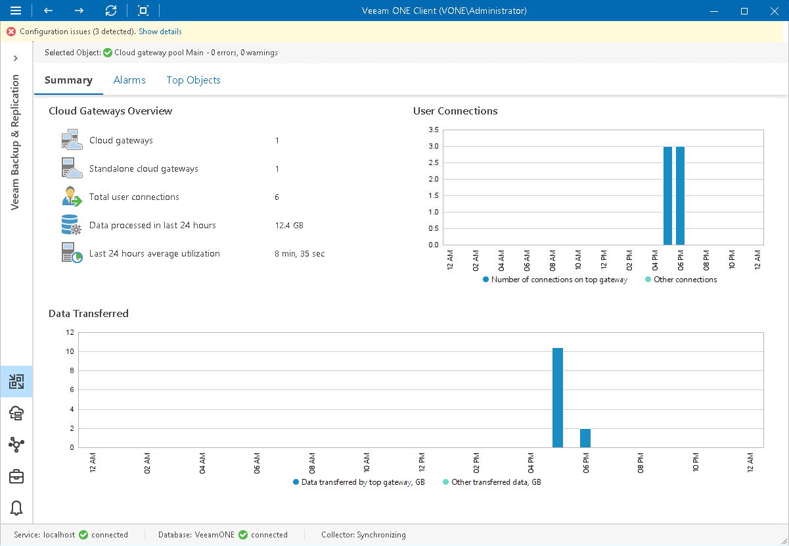

# Cloud Gateway Pool Summary

The cloud gateway pool summary dashboard provides overview information and performance analysis for the chosen gateway pool over the past day, week or month.

Cloud Gateways Overview

The section outlines the following details:

* Number of cloud gateways in a pool
* Number of users that connected to the gateways in the pool over the last 24 hours
* Amount of backup data that the cloud gateways in a pool processed over the last 24 hours
* Amount of time that the cloud gateways in the pool were retrieving, processing and transferring data

User Connections

The chart shows how many times the connection to the top cloud gateway and other gateways in a pool was established to transfer backup traffic over the past period.

Data Transferred

The chart shows the amount of backup data that the to the top cloud gateway and other gateways in a pool transferred to the cloud repository over the past period. The chart can help you measure the total amount of backup traffic coming through the cloud gateways in a pool.

Page updated 2026-07-17

