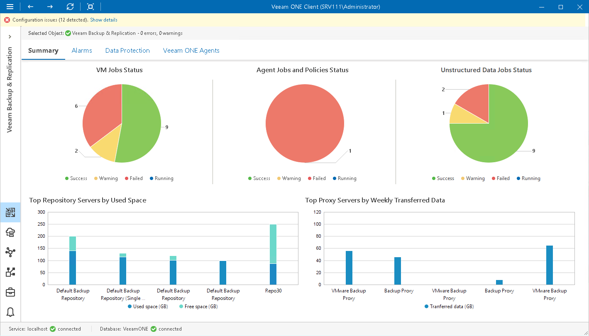

# Backup Infrastructure Summary

The backup infrastructure summary dashboard shows the latest state of data protection operations in the virtual environment and indicates the most intensively used resources in the backup infrastructure.

The dashboard is available for the following nodes:

* Backup Infrastructure
* Veeam Backup Enterprise Manager
* Veeam Backup & Replication server

VM Jobs Status, Agent Jobs and Policies Status, Unstructured Data Jobs Status

The charts reflect the latest status of VM protection jobs, agent protection jobs and policies, and file and object storage protection jobs for the selected level of the backup infrastructure hierarchy.

Every chart segment shows how many jobs ended with a specific status — failed jobs (red), jobs that ended with warnings (yellow), successfully performed jobs (green), and jobs that are currently running (blue). Click the necessary chart segment or a legend label to drill down to the list of jobs that ended up with the corresponding status.

For details on Veeam Backup & Replication VM job details, see [Virtual Machines](backup_jobs.md).

For details on Veeam Backup & Replication file and object storage job details, see [Unstructured Data](file_jobs.md).

For details on Veeam Agent for Microsoft Windows, Veeam Agent for Linux, Veeam Agent for Mac and Veeam Agent for Unix jobs and policies managed by Veeam Backup & Replication servers, see [Computers](agent_jobs.md).

Top Repository Servers by Used Space

The chart shows 5 backup repositories with the greatest amount of used storage space.

For every repository in the chart, you can track the amount of used storage space against the amount of available space. If free space on the repository is running low, you may need to free up storage space, revise your backup retention policy or even move your backups from the repository and point backup jobs to a new location.

Top Proxy Servers by Weekly Transferred Data

The chart shows 5 backup proxies that processed the greatest amount of data over the past 7 days.

To draw the chart, Veeam ONE analyzes how many VM disk, file share and object storage processing tasks were successfully performed by every proxy; failed tasks are not taken into account.

The chart helps you detect the most heavily loaded VM and file proxies and optimize the performance of your backup infrastructure. If specific proxies are overloaded with processing tasks, and the jobs often need to wait for proxy resources, you may need to deploy additional proxies or balance the processing load by assigning jobs to other proxies.

