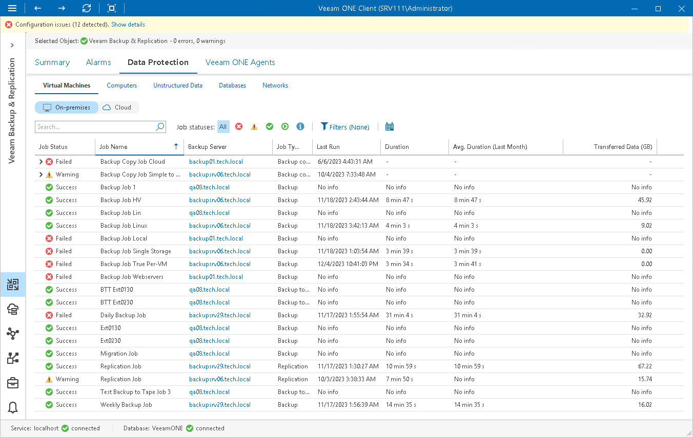
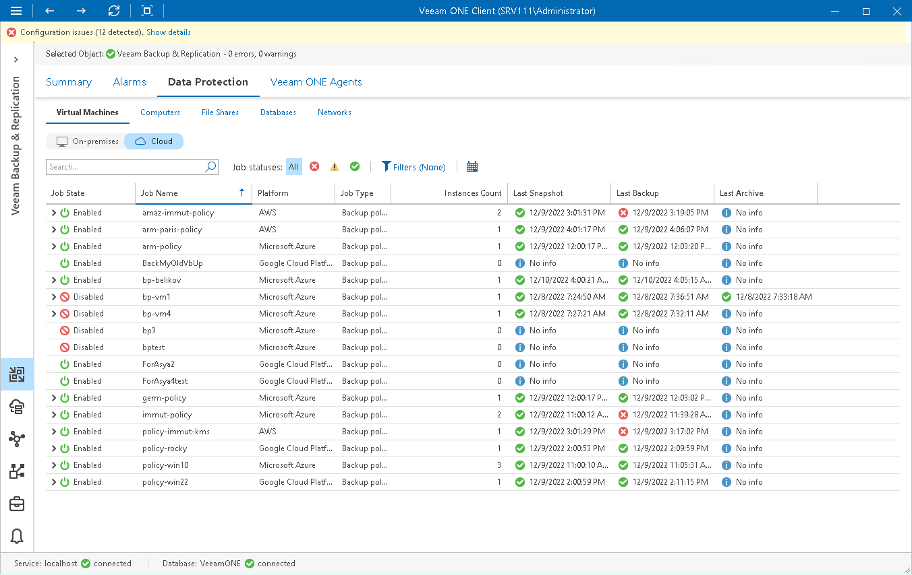

# Virtual Machines

Veeam ONE Client allows you to track jobs and policies configured to protect [on-premises virtual machines](#onprem) and [cloud virtual machines and instances](#cloud) with Veeam Backup & Replication.

You can track real-time job and policy statistics at different levels of your backup infrastructure:

* Jobs on a specific backup server
* Jobs on all backup servers controlled by Veeam Backup Enterprise Manager
* All jobs across the entire backup infrastructure

Viewing VM Job Details

To view the list of VM jobs at the necessary backup infrastructure level:

1. Open Veeam ONE Client.

For details, see [Accessing Veeam ONE Components](access.md).

1. At the bottom of the inventory pane, click Veeam Backup & Replication.
2. In the inventory pane, select the necessary backup infrastructure node.
3. Open the Data Protection tab and navigate to Virtual Machines > On-premises.
4. To find the necessary job, you can use filters at the top of the job list:

* To show or hide jobs that ended with a specific status, use the status buttons at the top of the list (Show all jobs, Show failed jobs, Show jobs with warnings, Show successful jobs, Show running jobs or Show jobs with no status).
* To show or hide jobs of a specific type, use the job type filter at the top of the list (Backup, Replication, Backup copy, Backup to tape, CDP policy, VM copy, SureBackup, Microsoft SQL database transaction log backup, Oracle Database transaction log backup, PostgreSQL transaction log backup, or Snapshot-only).
* To show or hide jobs that protect VMs residing on a specific hypervisor, use the platform filter at the top of the list (VMware vSphere, VMware Cloud Director, Microsoft Hyper-V, Nutanix AHV, oVirt KVM and ProxMox VE).
* To set the time interval when jobs ran for the last time, use the Filter jobs by time period button. Release the button to discard the time period filter.
* To find jobs by name, use the search field at the top of the list.

The list of jobs shows all types of VM jobs for the backup infrastructure level that you selected in the inventory pane.

Each job in the list is described with a set of properties. To show or hide properties, right-click the list header and choose properties that must be displayed.

* Job Status — latest status of the job session (Success, Warning, Failed, Running, or jobs with no status).
* Job Name — name of the job.
* Backup Server — name of the backup server on which the job is configured. Click the server name link to drill down to the list of alarms for a chosen backup server.
* Job Type — type of the job (Backup, Replication, Backup copy, Backup to tape, CDP policy, VM copy, SureBackup, Microsoft SQL database transaction log backup, Oracle Database transaction log backup, PostgreSQL transaction log backup, or Snapshot-only).
* Last Run — date and time of the latest job run.
* Duration — time taken to complete the job during its latest run.
* Avg. Duration (Last Month) — average time taken to complete the job (total job duration time for the previous month divided by the number of times the job ran).
* Transferred Data (GB) — amount of backup data that was transferred to the target destination (backup repository or replication target datastore/volume) during the latest job run.

|  |
| --- |
| Note: |
| The “No info” label indicates that no information is available for the job because data has not been collected yet. |

Viewing Cloud VM Job Details

To view the list of cloud VM policies and jobs at the necessary backup infrastructure level:

1. Open Veeam ONE Client.

For details, see [Accessing Veeam ONE Components](access.md).

1. At the bottom of the inventory pane, click Veeam Backup & Replication.
2. In the inventory pane, select the necessary backup infrastructure node.
3. Open the Data Protection tab and navigate to Virtual Machines > Cloud.
4. To find the necessary job or policy, you can use filters at the top of the policies list:

* To show or hide jobs and policies whose sessions ended with a specific status, use the status buttons at the top of the list (Show all jobs, Show jobs with errors, Show jobs with warnings, Show successful jobs).

* To show or hide jobs and policies of a specific type, use the job type filter at the top of the list (Backup policy, Backup copy, Backup to tape).

* To show or hide jobs and policies configured for a specific platform, use the platform type filter at the top of the list (AWS, Microsoft Azure, Google Cloud Platform).

* To set the time interval when jobs and policies ran for the last time, use the Filter jobs by time period button. Release the button to discard the time period filter.

* To find jobs and policies by name, use the search field at the top of the list.

The list of jobs shows all Veeam Backup for Microsoft Azure, Veeam Backup for AWS and Enter value policies and jobs for the backup infrastructure level that you selected in the inventory pane.

Each job in the list is described with a set of properties. To show or hide properties, right-click the list header and choose properties that must be displayed.

* Job State — state of the cloud policy or job schedule (Enabled, Disabled).

Click the > icon to show details of the last cloud protection sessions based on a specific policy.

* Job Status — latest status of the cloud policy or job session (Success, Warning, Failed, Running, or jobs with no status).
* Job Name — name of the cloud policy or job.

* Platform — name of the cloud platform for which the policy or job is configured.
* Job Type — backup job or policy type (Backup policy, Backup copy, Backup to tape).
* Instance Type — type of a protected instance.
* Backup Server — name of a backup server to which external repository with cloud backups is connected.

Click the server name link to drill down to the list of alarms for a chosen backup server.

* Instances Count — number of Microsoft Azure VMs, AWS EC2 or Google Cloud instances processed during the last cloud protection session.
* Last Snapshot — date and time when the latest cloud-native snapshot was created for a Microsoft Azure VM, AWS EC2 or Google Cloud instance.
* Last Backup — date and time of the latest backup restore point was created for a Microsoft Azure VM, AWS EC2 or Google Cloud instance.
* Last Replication — date and time of the latest replication restore point was created for AWS EC2 instance.
* Last Archive — date and time of the latest archive restore point was created for a cloud instance.
* Last Run — date and time of the latest policy run.
* Instance ID — id of a Microsoft Azure VM, AWS EC2 or Google Cloud instance.

* Duration — time taken to complete the job during its latest run.
* Avg. Duration (Last Month) — average time taken to complete the job (total job duration time for the previous month divided by the number of times the job ran).
* Transferred Data (GB) — amount of backup data that was transferred to the target destination during the latest job run.

|  |
| --- |
| Note: |
| The “No info” label indicates that no information is available for the job because data has not been collected yet. |

