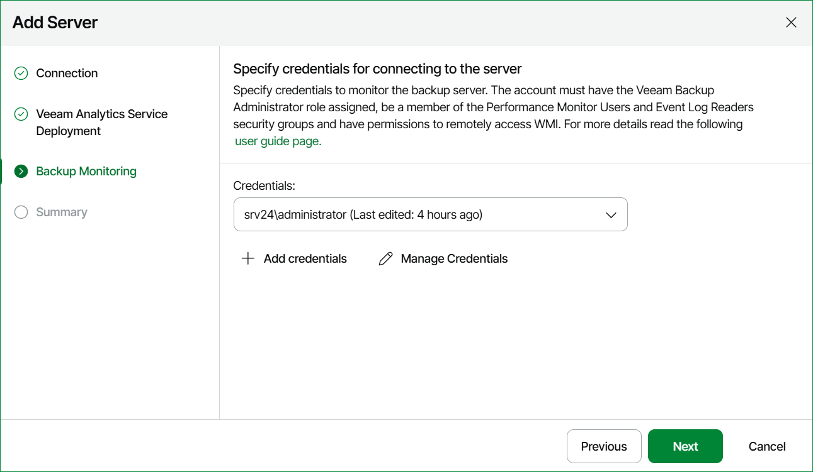

# Step 5. Specify Backup Monitoring Credentials

If you are adding a Veeam Backup & Replication deployed on Microsoft Windows, at the Backup Monitoring step of the wizard, specify credentials to connect to the backup server.  For details on account permissions, see [Connection to Veeam Backup & Replication Servers](connection_to_backup_servers.md). For details on adding credentials records, see [Security](credentials_manager.md).

The provided credentials will be used to connect the backup server and all managed servers in the backup infrastructure:

* Veeam Backup & Replication servers (if you connect Veeam Backup Enterprise Manager)
* Backup proxies
* Backup repositories
* WAN Accelerators
* Tape servers
* Cloud Gateways

