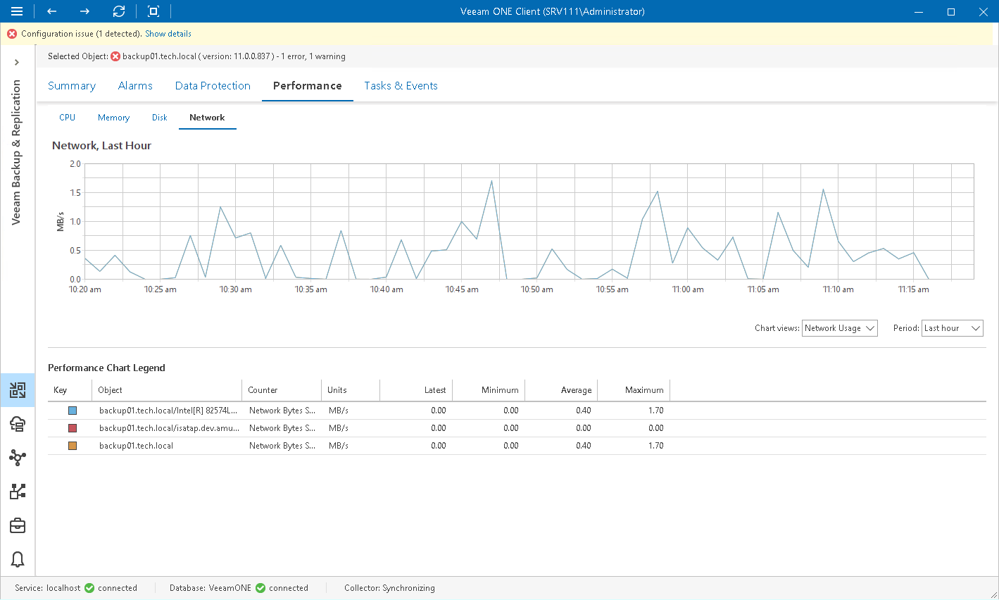

# Network Performance Chart

The Network chart shows the throughput for NICs on a machine where a backup infrastructure component runs. Graphs in the Network chart illustrate the rate at which data is sent on the network interface for each separate NIC. A separate graph shows the cumulative rate for all NICs on the machine.

