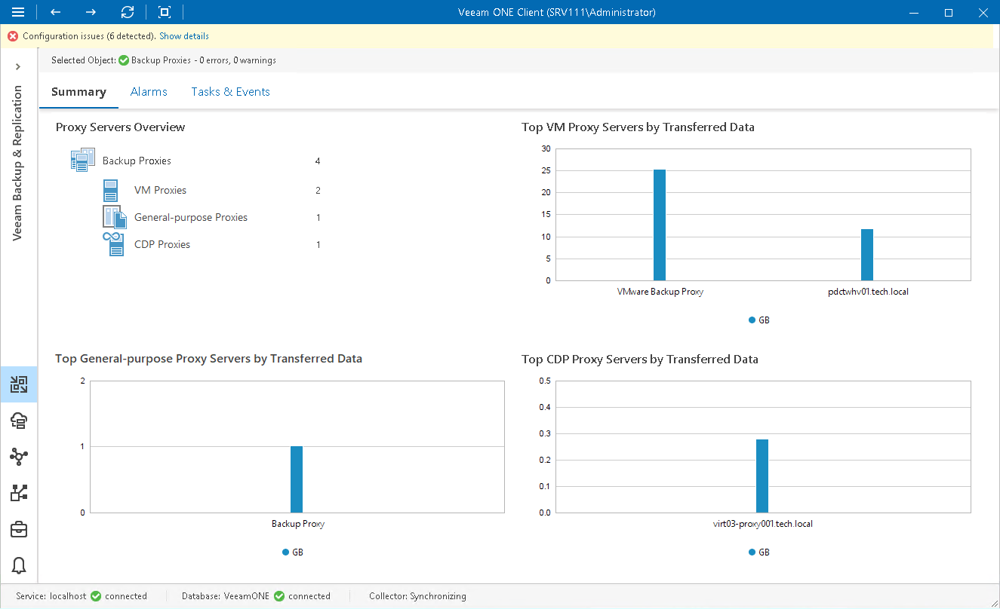

# Backup Proxies Overview

The summary dashboard for the Proxies node provides a configuration overview and performance analysis for VM, general-purpose and CDP proxies managed by a backup server.

This dashboard can help you detect configuration inefficiencies in your data protection infrastructure. If the same proxy server appears to process a great number of disks, transfer the greatest amount of backup data and use the largest backup window, you may need to re-balance the processing load across your backup proxies. The charts may also help you reveal 'lazy' proxies that you may decide to decommission.

Proxy Servers Overview

The section shows the breakdown of backup proxies by the proxy type (VM Proxies, General-purpose Proxies, CDP Proxies).

Top VM Proxy Servers by Transferred Data

The chart shows 5 backup proxies that transferred the greatest amount of backup data to the target destination (backup repository or replica datastore/volume) over the past 7 days.

For every backup proxy, the chart shows the total amount of data that the proxy transferred over the network after the source-side deduplication and compression. The chart can help you detect backup proxies that transfer the greatest amount of backup data and estimate the load that backup and replication jobs impose on the network.

Top General-purpose Proxy Servers by Transferred Data

The chart shows 5 file proxies that transferred the greatest amount of backup data to the target destination (backup repository) over the last 7 days.

For every backup proxy, the chart shows the total amount of data that the proxy transferred over the network after the source-side deduplication and compression. The chart can help you detect backup proxies that transfer the greatest amount of backup data and estimate the load that unstructured data backup jobs impose on the network.

Top CDP Proxy Servers by Transferred Data

The chart shows 5 CDP proxies that transferred the greatest amount of VM data to the target host over the last 7 days.

For every proxy, the chart shows the total amount of data that the proxy transferred over the network after the source-side deduplication and compression. The chart can help you detect proxies that transfer the greatest amount of data and estimate the load that CDP sessions impose on the network.

In This Section

* [VM Proxy Servers Overview](vm_proxies_overview.md)
* [General-Purpose Proxy Servers Overview](file_proxies_overview.md)
* [CDP Proxy Servers Overview](cdp_proxies_overview.md)

