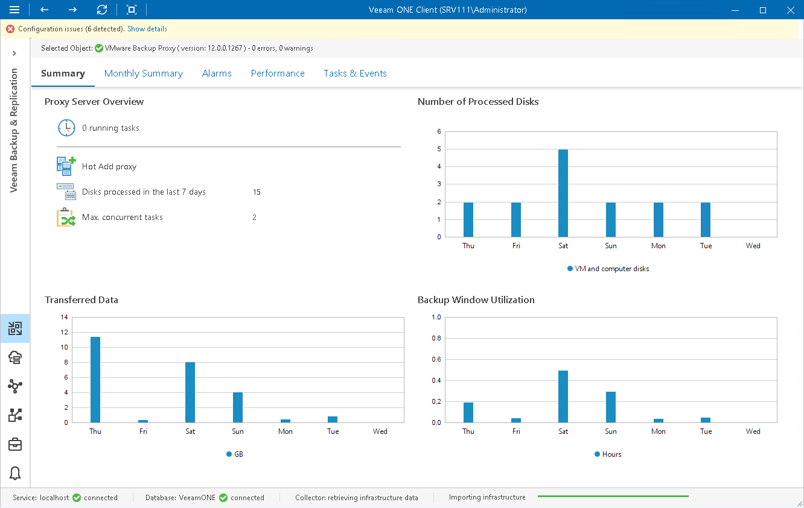
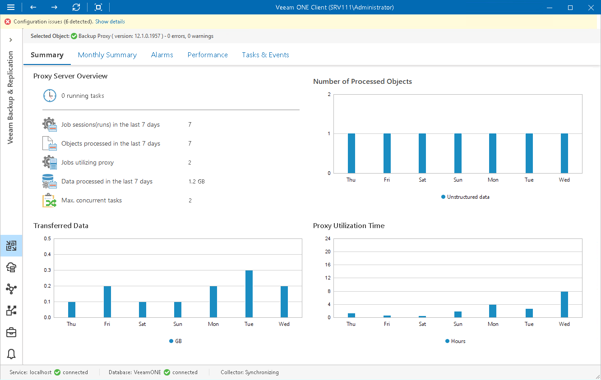
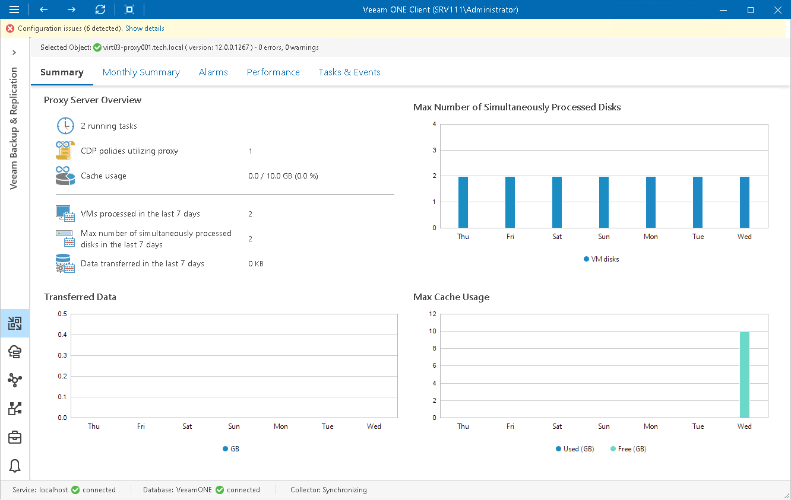

# Backup Proxy Summary

Veeam ONE Client offers the following types of summary dashboards for proxy servers:

* [VM proxy summary](backup_proxy_summary.md#vm)
* [General-purpose proxy summary](#file)
* [CDP proxy summary](#cdp)

VM Proxy Summary

The VM proxy summary dashboard provides overview details and performance analysis for a chosen VM backup proxy for the last week or month.

|  |
| --- |
| Note: |
| Veeam Cloud Connect service providers cannot see performance data for proxies used by tenant data protection jobs. |

Proxy Server Overview

The section provides the following details:

* Number of tasks that the proxy is currently processing
* Mode that the proxy uses to process VM disks (Direct SAN Access, Hot Add or Network for VMware backup proxies; on-host or off-host for Hyper-V proxies)
* Number of VM disks that the proxy has processed during the last 7 days
* Number of concurrent VM disk processing tasks that can be assigned to the proxy (as configured in proxy settings)

Number of Processed Disks

The chart shows how many VM disks the proxy processed over the last 7 days.

To draw the chart, Veeam ONE Client analyzes how many disk processing tasks were successfully performed by the proxy; failed tasks are not taken into account.

The chart helps you to analyze workload on the proxy and optimize the performance of your backup infrastructure. If the proxy is overloaded with processing tasks, and the tasks often need to wait for the proxy resources, you may need to deploy additional proxies or balance the processing load by assigning jobs to other proxies.

Transferred Data

The chart shows the amount of backup data that the proxy transferred to the target destination (backup repository or replica, datastore/volume) over the last 7 days.

The chart shows the total amount of data that the proxy transferred over the network after the source-side deduplication and compression. The chart can help you measure the amount of backup traffic coming from the proxy.

Backup Window Utilization

The chart allows you to estimate how 'busy' the proxy was during the last 7 days. The chart shows the cumulative amount of time that the proxy was retrieving, processing and transferring VM data.

The chart can help you reveal possible resource bottlenecks. If the backup window on the chart is abnormally large, this can evidence of low source data retrieval speed, high proxy CPU load or insufficient network throughput. To identify performance bottlenecks, you can switch to proxy [Veeam Backup & Replication Performance Charts](backup_charts.md).

General-Purpose Proxy Summary

The general-purpose proxy summary dashboard provides overview details and performance analysis for a chosen general-purpose proxy for the last week or month.

Proxy Server Overview

The section provides the following details:

* Number of tasks that the proxy is currently processing
* Number of job sessions that the proxy has processed during the last 7 days
* Number of objects that the proxy has processed during the last 7 days
* Number of file and object storage backup jobs configured to use the proxy
* Total amount of data that the proxy has processed during the last 7 days
* Number of concurrent object processing tasks that can be assigned to the proxy (as configured in proxy settings)

Number of Processed Files

The chart shows how many objects the proxy processed over the last 7 days.

To draw the chart, Veeam ONE Client analyzes how many objects were successfully processed by the proxy.

The chart helps you to analyze workload on the proxy and optimize the performance of your backup infrastructure. If the proxy is overloaded with processing tasks, and the tasks often need to wait for the proxy resources, you may need to deploy additional proxies or balance the processing load by assigning jobs to other proxies.

Transferred Data

The chart shows the amount of backup data that the proxy transferred to the target destination (backup repository) over the last 7 days.

The chart shows the total amount of data that the proxy transferred over the network after the source-side deduplication and compression. The chart can help you measure the amount of backup traffic coming from the proxy.

Proxy Utilization Time

The chart allows you to estimate how 'busy' the proxy was during the last 7 days. The chart shows the cumulative amount of time that the proxy was retrieving, processing and transferring file share data.

The chart can help you reveal possible resource bottlenecks. If the utilization time on the chart is abnormally large, this can evidence of low source data retrieval speed, high proxy CPU load or insufficient network throughput. To identify performance bottlenecks, you can switch to proxy [Veeam Backup & Replication Performance Charts](backup_charts.md).

CDP Proxy Summary

The CDP proxy summary dashboard provides overview details and performance analysis for a chosen CDP proxy for the last week or month.

Proxy Server Overview

The section provides the following details:

* Number of tasks that the proxy is currently processing

* Number of CDP policies configured to use the proxy
* Total amount of cache data used by the proxy

* Number of VMs that the proxy has processed in the last 7 days
* Maximum number of VM disks that the proxy has simultaneously processed in the last 7 days
* Total amount of data that the proxy has processed during the last 7 days

Max Number of Simultaneously Processed Disks

The chart shows how many VM disks the proxy processed over the last 7 days.

To draw the chart, Veeam ONE Client analyzes how many VM disks were successfully processed by the proxy.

The chart helps you to analyze workload on the proxy and optimize the performance of your backup infrastructure. If the proxy is overloaded with processing tasks, and the tasks often need to wait for the proxy resources, you may need to deploy additional proxies or balance the processing load by assigning jobs to other proxies.

Transferred Data

The chart shows the amount of VM data that the proxy transferred to the target host over the last 7 days.

The chart shows the total amount of data that the proxy transferred over the network after the source-side deduplication and compression. The chart can help you measure the amount of traffic coming from the proxy.

Max Cache Usage

The chart shows the amount of temporary cached data that the proxy offloaded to the cache folder and the amount of free space in this folder over the last 7 days. If the size of the offloaded cache changed during the day, the chart will show the maximum size.

The chart can help you analyze how data blocks of continuously replicated VMs change during the week and estimate if the proxy require allocating more storage space.

