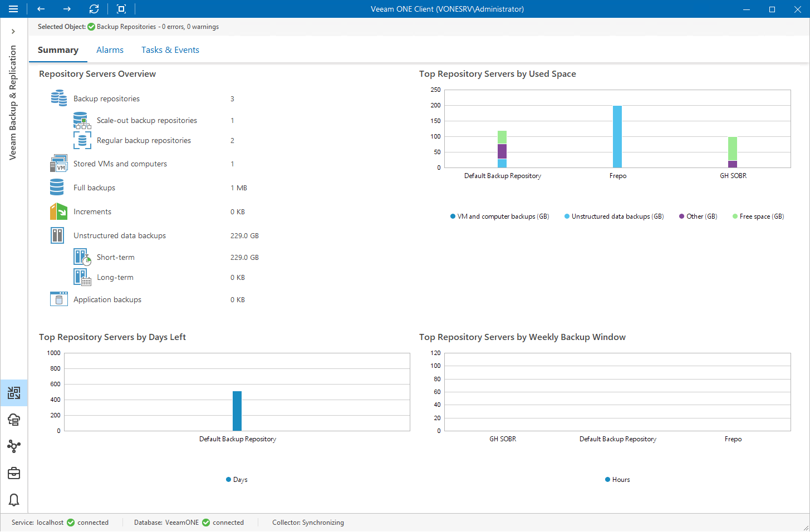

# Backup Repositories Overview

The summary dashboard for the Repositories node provides a configuration overview and performance analysis for backup repositories managed by a backup server.

Repository Servers Overview

The section provides the following details:

* Number of repositories managed by the backup server
* Number of scale-out backup repositories
* Number of external repositories
* Number of object storage repositories
* Number of regular backup repositories
* Number of VMs and computers whose data is stored in backups on repositories
* Cumulative amount of storage space occupied by full VM and computer backups
* Cumulative amount of storage space occupied by incremental VM and computer backups
* Amount of space occupied by short-term and long-term unstructured data backups
* Amount of space occupied by application backups

Top Repository Servers by Used Space

The chart shows 5 backup repositories with the greatest amount of used storage space.

For every repository in the chart, you can see the amount of storage space used by VM, agent, unstructured data and application backups against the amount of available space. If free space on the repository is running low, you may need to free up storage space on the repository or revise your backup retention policy.

Top Repository Servers by Days Left

The chart shows 5 backup repositories that can run low on storage space sooner than others.

To draw the chart, Veeam ONE analyzes historical data and checks how fast free space on repositories has been decreasing in the past. Veeam ONE uses historical statistics to forecast how soon the repository will run out of space.

Top Repository Servers by Weekly Backup Window

The chart allows you to detect the most ‘busy’ repositories over the past 7 days.

For every repository, the chart shows the cumulative amount of time that the repository was busy with backup, backup copy and unstructured data backup job tasks.

