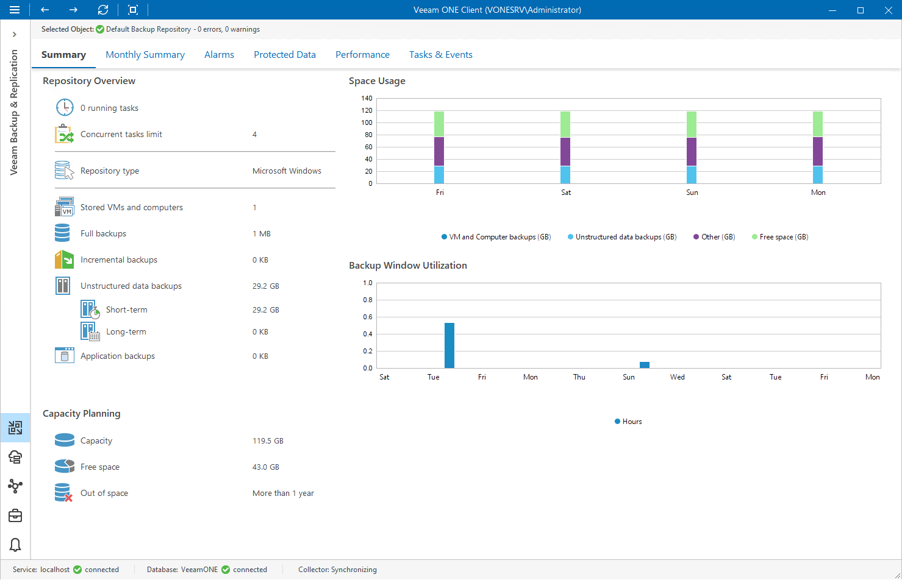
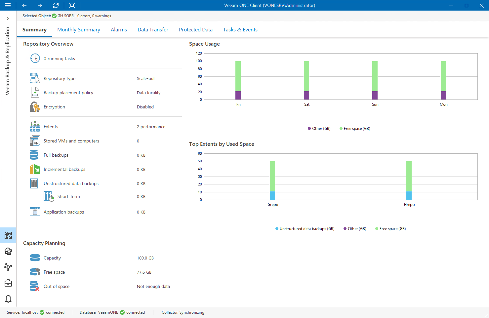
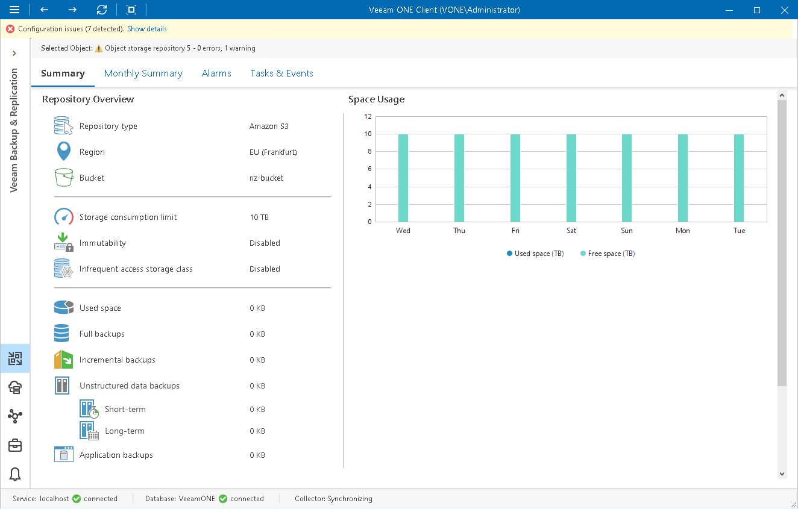
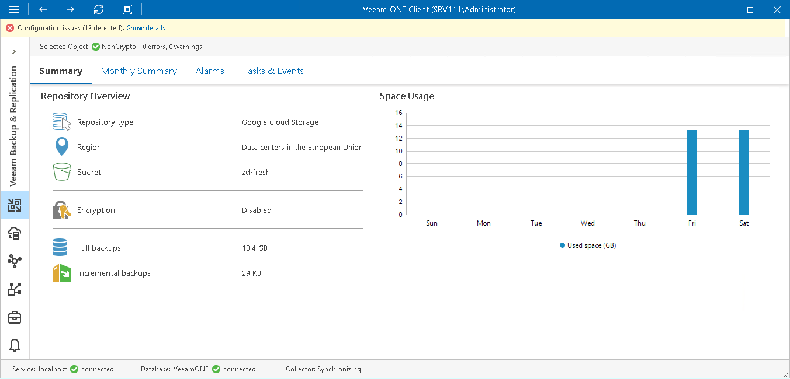

# Backup Repository Summary

Veeam ONE Client offers the following types of summary dashboards for backup repositories:

* [Regular backup repository summary](backup_repository_summary.md#regular)
* [Scale-out backup repository summary](backup_repository_summary.md#scaleout)
* [Object storage repository summary](backup_repository_summary.md#object)
* [External repository summary](backup_repository_summary.md#external)

Regular Backup Repository Summary

The regular repository summary dashboard provides overview details, capacity planning information and performance analysis for a chosen backup repository for the last week or month.

Repository Overview

The section provides the following details:

* Number of tasks that are currently running on the repository
* Maximum number of concurrent tasks allowed for the repository
* Repository type
* [For Linux repositories] Immutability feature state (Enabled, Disabled, N/A)

* Number of VMs and computers whose data is stored in backups on the repository

* Cumulative amount of storage space occupied by full VM and computer backups
* Cumulative amount of storage space occupied by incremental VM and computer backups
* Cumulative amount of storage space occupied by short- and long-term unstructured data backups
* Cumulative amount of storage space occupied by enterprise application backups

Capacity Planning

The section provides the following details:

* Storage capacity of the repository
* Amount of free space on the repository
* Number of days before the repository runs out of free space

To forecast the value, Veeam ONE uses a trend that is calculated based on historical statistics — it analyzes how fast the amount of free space on the repository was decreasing in the past and uses historical statistics to forecast how soon the repository will run out of space.

Space Usage

The chart shows the amount of used storage space against the amount of available space on the repository.

If free space on the repository is running low, you may need to free up storage space on the repository, revise your backup retention policy, or consider pointing jobs to a scale-out backup repository.

Backup Window Utilization

The chart shows the cumulative amount of time that the repository was busy with backup job tasks and backup copy job tasks during the past week or month.

The chart can help you reveal possible resource bottlenecks on the repository side. If the backup window on the chart is abnormally large, this may evidence that the required I/O operations cannot complete fast enough, and your target is presenting a bottleneck for the whole backup data processing conveyor. To identify performance bottlenecks, you can switch to repository [Veeam Backup & Replication Performance Charts](backup_charts.md).

Scale-Out Backup Repository Summary

The scale-out repository summary dashboard provides overview details, capacity planning information and performance analysis for a chosen scale-out backup repository for the last week or month. You can select underlying scale-out repository extents to see details of performance, capacity and archive tiers. For details on scale-out repository configuration, see section [Scale-Out Backup Repository](https://helpcenter.veeam.com/docs/backup/vsphere/backup_repository_sobr.html?ver=120) of the Veeam Backup & Replication User Guide.

Repository Overview

The section provides the following details:

* Number of tasks that are currently running on the repository
* Repository type (Scale-out backup repository)

* Backup placement policy (as configured in the scale-out repository settings)
* Copy policy (as configured in the capacity tier settings)
* Move policy (as configured in the capacity tier settings)
* Archiving policy (as configured in the archive tier settings)
* Number of performance, capacity and archive tier extents that make up the scale-out backup repository

* Number of VMs and computers whose data is stored in backups on the repository

* Cumulative amount of storage space occupied by full VM and computer backups
* Cumulative amount of storage space occupied by incremental VM and computer backups

* Cumulative amount of storage space occupied by short- and long-term unstructured data backups

* Cumulative amount of storage space occupied by enterprise application backups

Capacity Planning

The section provides the following details:

* Storage capacity of the repository
* Amount of free storage space on the repository
* Number of days before the repository runs out of free space.

To forecast the value, Veeam ONE uses a trend that is calculated based on historical statistics — it analyzes how fast the amount of free space on the repository was decreasing in the past and uses historical statistics to forecast how soon the repository will run out of space.

Space Usage

The chart shows the amount of used storage space against the amount of available space on the repository.

If free space on the repository is running low, you may need to free up storage space on the repository, revise your backup retention policy, or consider pointing jobs to another repository.

Top Extents by Used Space

The chart shows extents with the greatest amount of used storage space.

For every extent in the chart, you can see the amount of used storage space against the amount of available space.

Object Storage Repository Summary

The object storage repository summary dashboard provides overview details and performance analysis for a chosen object storage repository added as a Capacity Tier for the last week or month.

Repository Overview

The section provides the following details:

* Repository type
* Region at which the repository is located
* Name of bucket or container

* Limit of storage consumption

* Immutability feature state (Enabled, Disabled, N/A)
* Class of the infrequent access storage
* Cumulative amount of storage space occupied by full and incremental VM and computer backups
* Cumulative amount of storage space occupied by short- and long-term unstructured data backups

Capacity Planning

The section provides the following details:

* Storage capacity of the repository
* Amount of free storage space on the repository
* Number of days before the repository runs out of free space.

To forecast the value, Veeam ONE uses a trend that is calculated based on historical statistics — it analyzes how fast the amount of free space on the repository was decreasing in the past and uses historical statistics to forecast how soon the repository will run out of space.

Space Usage

The chart shows the amount of used storage space against the amount of available space on the repository.

If free space on the repository is running low, you may need to free up storage space on the repository, revise your backup retention policy, or consider pointing jobs to another repository.

External Repository Summary

The external repository summary dashboard provides overview details and performance analysis for a chosen external repository for the last week or month.

Repository Overview

The section provides the following details:

* Repository type
* Region at which the repository is located
* Name of a bucket or container

* Number of cloud VMs whose data is stored in backups on the repository

* Cumulative amount of storage space occupied by full cloud VM backups
* Cumulative amount of storage space occupied by incremental cloud VM backups
* Encryption settings (as configured in the external repository settings)

Space Usage

The chart shows the amount of storage space used by the files on the repository.

If the space consumed on the repository is running high, you may need to free up storage space on the repository, revise your backup retention policy, or consider using another repository.

