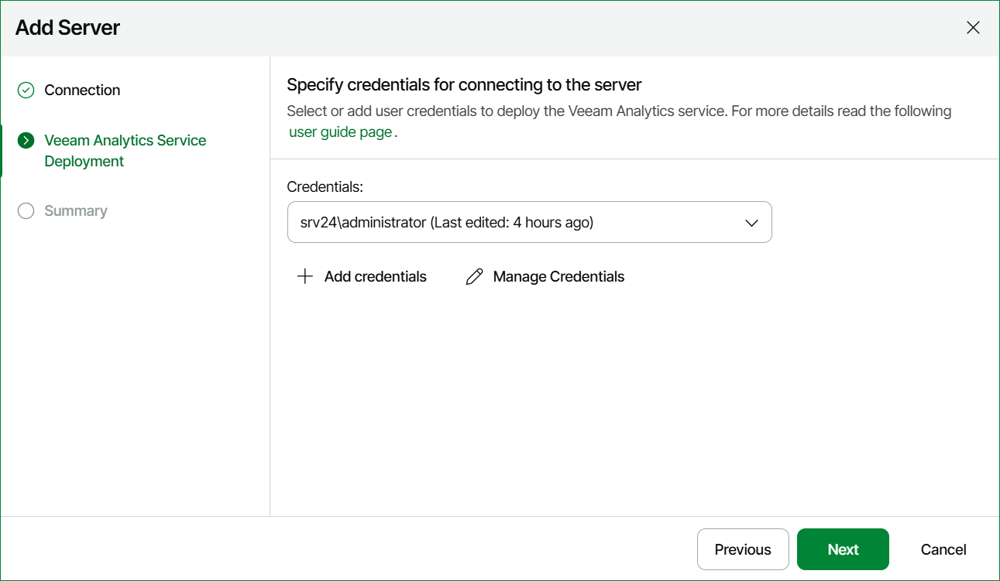

# Step 4. Specify Veeam Analytics Service Deployment Credentials

At the Veeam Analytics Service Deployment step of the wizard, specify credentials to install Veeam Analytics service. For details on account permissions, see [Veeam Analytics Service deployment credentials](connection_to_backup_servers.md#agent). For details on adding credentials records, see [Security](credentials_manager.md).

When you add a Veeam Backup & Replication host, Veeam ONE saves to the configuration database a thumbprint of the TLS certificate installed on the Veeam Backup & Replication host. During every subsequent connection to the server, Veeam ONE uses the saved thumbprint to verify the server identity and avoid the man-in-the-middle attack.

If the certificate installed on the server is not trusted, Veeam ONE displays a warning.

* To view detailed information about the certificate, click View Certificate.

* If you trust the server, click Trust and Continue.
* If you are installing on a high availability cluster, you may need to trust multiple certificates depending on the administration setup of each node within the cluster.
* If you are adding a high availability cluster, Veeam Analytics service must be installed on both nodes in the cluster where it is not already present. It is recommended to use the same user on each node in the cluster. Otherwise, Veeam Analytics service may not install correctly on the secondary node, and you may need to perform a manual installation. For details on setting up high availability clusters in Veeam Backup & Replication, see [Assembling High Availability Cluster](https://helpcenter.veeam.com/docs/vbr/userguide/high_availability_configuration.html).

* If you do not trust the server, click Cancel. Veeam ONE will display an error message, and you will not be able to connect to the server.

Page updated 2026-08-03

