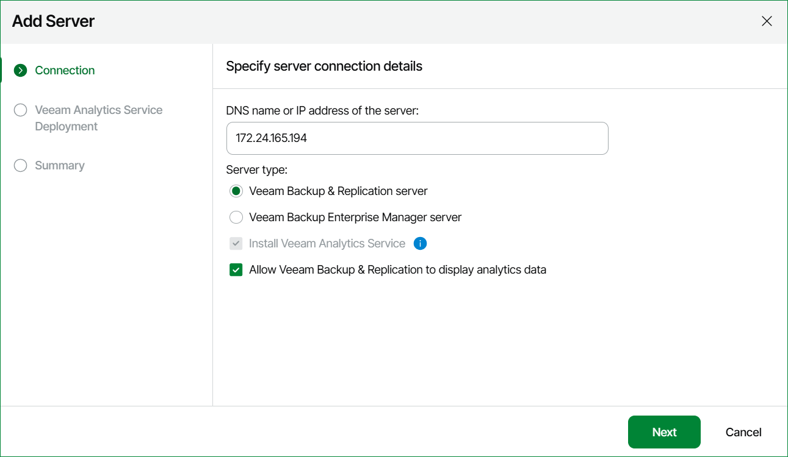

# Step 3. Specify Server Name and Role

At the Connection step of the wizard:

1. Enter the DNS name or IP address of the backup server you want to connect.

If you are adding a High Availability cluster, use the IP address or hostname of the primary node.

1. Specify the server role — Veeam Backup & Replication server or Veeam Backup Enterprise Manager.

If you choose to add Veeam Backup Enterprise Manager, Veeam ONE will automatically connect all Veeam Backup & Replication servers added to the Veeam Backup Enterprise Manager.

1. If you want to enable Veeam ONE dashboard and report integration in Veeam Backup & Replication, select the Allow Veeam Backup & Replication to display analytics data check box. For details, see [Veeam Backup & Replication Web UI](https://helpcenter.veeam.com/docs/vbr/userguide/vbr_web_console.html?ver=13#analytics).

|  |
| --- |
| Note |
| Veeam Analytics service must be installed when adding Veeam Backup & Replication servers. |

