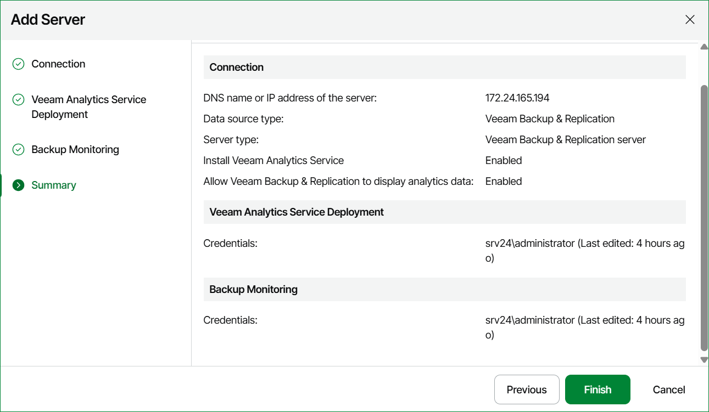

# Step 6. Review Connection Settings

At the Summary step of the wizard, review the connection details and click Finish.

Keep in mind that it may take a while for Veeam ONE to collect and display configuration and performance data for the newly added backup server and managed backup infrastructure components.

* After you connect a Veeam Backup & Replication server, Veeam ONE imports all historical data that is stored on the backup server.
* After you connect a Veeam Backup Enterprise Manager server, Veeam ONE automatically builds the hierarchy of all managed backup servers. Next, it connects managed backup servers and imports from these servers data on job sessions.

