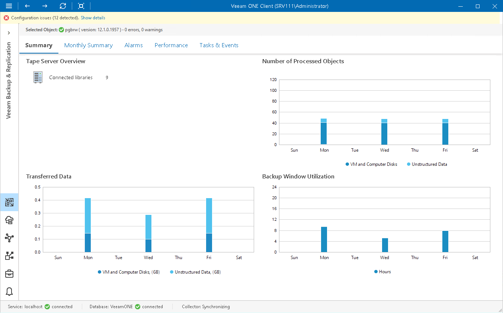

# Tape Server Summary

The tape server summary dashboard provides overview information and performance analysis for the chosen tape server.

Tape Server Overview

The section outlines the number of tape libraries connected to the tape server.

Number of Processed Objects

The chart shows how many VM and computer disks and unstructured data items the tape server processed and archived to tape over the past 7 days. To draw the chart, Veeam ONE calculates the total number of VM and computer disks and unstructured data items in all backup restore points archived to tape.

Transferred Data

The chart shows the amount of data that the tape server transferred to tape devices over the past 7 days. The chart can help you measure the amount of traffic coming from the tape server.

Backup Window Utilization

The chart allows you to estimate how ‘busy’ the tape server was during the past 7 days. The chart shows the cumulative amount of time that the tape server was retrieving, processing and transferring data.

The chart can help you reveal possible resource bottlenecks. If the backup window on the chart is abnormally large, this can evidence of low source data retrieval speed, high CPU load or insufficient network throughput.

