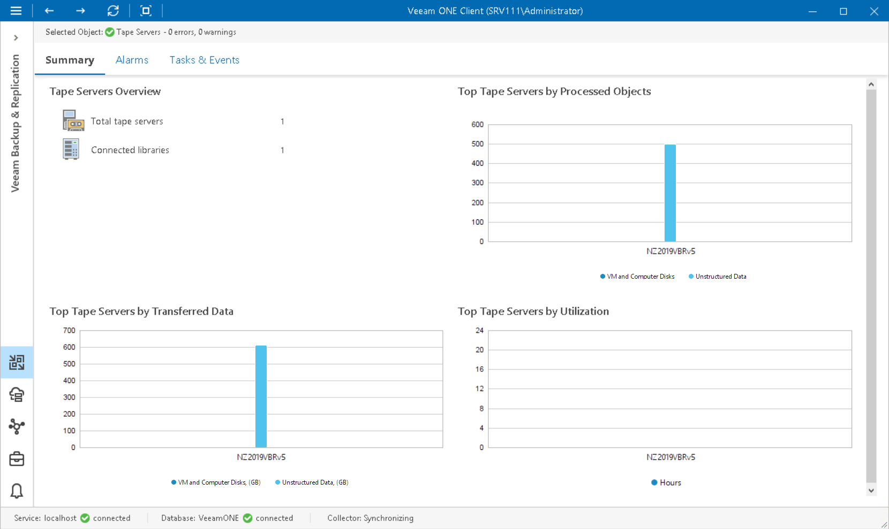

# Tape Servers Overview

The summary dashboard for the Tape Servers node presents a configuration overview and performance analysis for tape servers managed by a backup server.

Tape Servers Overview

The section shows the number of tape servers managed by a Veeam Backup & Replication server, and tape libraries connected to these servers.

Top Tape Servers by Processed Objects

The chart shows 5 tape servers that processed and archived to tape the greatest number of VM and computer disks and unstructured data items over the past 7 days. To draw the chart, Veeam ONE calculates the total number of VM and computer disks and unstructured data items in all backup restore points archived to tape.

Top Tape Servers by Transferred Data

The chart shows 5 tape servers that transferred the greatest amount of data to tape devices over the past 7 days.

Top Tape Servers Utilization

The chart allows you to detect the most 'busy' tape servers over the past 7 days. For every tape server, the chart shows the cumulative amount of time that the server was retrieving, processing and transferring data.

The chart can help you reveal possible resource bottlenecks. If the graph on the chart is abnormally large, this can evidence of low data retrieval speed, high CPU load or insufficient network throughput.

